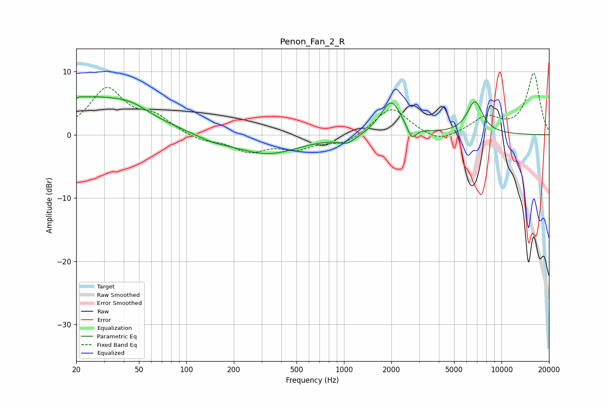

# Penon_Fan_2_R
See [usage instructions](https://github.com/jaakkopasanen/AutoEq#usage) for more options and info.

### Parametric EQs
Apply preamp of -6.1 dB when using parametric equalizer.

|   # | Type    |   Fc (Hz) |    Q |   Gain (dB) |
|-----|---------|-----------|------|-------------|
|   1 | Peaking |        20 | 5.99 |        -3.2 |
|   2 | Peaking |        20 | 5.84 |         3.3 |
|   3 | Peaking |        25 | 0.47 |         5.7 |
|   4 | Peaking |        45 | 1.35 |         1.1 |
|   5 | Peaking |       145 | 1.36 |        -0.7 |
|   6 | Peaking |       324 | 0.68 |        -3.1 |
|   7 | Peaking |      1050 | 2.5  |        -1.2 |
|   8 | Peaking |      1991 | 2.2  |         5.4 |
|   9 | Peaking |      2690 | 5.07 |        -2.1 |
|  10 | Peaking |      6770 | 2.75 |         5.1 |

### Fixed Band EQs
When using fixed band (also called graphic) equalizer, apply preamp of **-9.8 dB** (if available) and set gains manually with these parameters.

|   # | Type    |   Fc (Hz) |    Q |   Gain (dB) |
|-----|---------|-----------|------|-------------|
|   1 | Peaking |        31 | 1.41 |         7.1 |
|   2 | Peaking |        62 | 1.41 |         2.5 |
|   3 | Peaking |       125 | 1.41 |        -1   |
|   4 | Peaking |       250 | 1.41 |        -2.5 |
|   5 | Peaking |       500 | 1.41 |        -1.9 |
|   6 | Peaking |      1000 | 1.41 |        -1.5 |
|   7 | Peaking |      2000 | 1.41 |         4.4 |
|   8 | Peaking |      4000 | 1.41 |        -1.5 |
|   9 | Peaking |      8000 | 1.41 |         2.6 |
|  10 | Peaking |     16000 | 1.41 |         9.7 |

### Graphs

