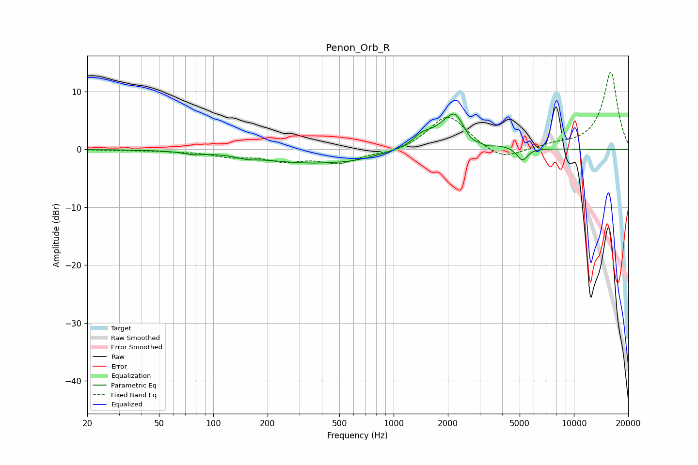

# Penon_Orb_R
See [usage instructions](https://github.com/jaakkopasanen/AutoEq#usage) for more options and info.

### Parametric EQs
Apply preamp of -6.2 dB when using parametric equalizer.

|   # | Type    |   Fc (Hz) |    Q |   Gain (dB) |
|-----|---------|-----------|------|-------------|
|   1 | Peaking |        78 | 2.6  |        -0.4 |
|   2 | Peaking |       154 | 2.87 |        -0.4 |
|   3 | Peaking |       361 | 0.46 |        -2.4 |
|   4 | Peaking |       607 | 1.49 |        -0.3 |
|   5 | Peaking |      1433 | 3.01 |         1.4 |
|   6 | Peaking |      2173 | 1.49 |         6.3 |
|   7 | Peaking |      2184 | 5.98 |         0.7 |
|   8 | Peaking |      2688 | 3.15 |        -2   |
|   9 | Peaking |      3304 | 3.6  |        -0.8 |
|  10 | Peaking |      5176 | 4.71 |        -2.3 |

### Fixed Band EQs
When using fixed band (also called graphic) equalizer, apply preamp of **-13.5 dB** (if available) and set gains manually with these parameters.

|   # | Type    |   Fc (Hz) |    Q |   Gain (dB) |
|-----|---------|-----------|------|-------------|
|   1 | Peaking |        31 | 1.41 |        -0.1 |
|   2 | Peaking |        62 | 1.41 |        -0.2 |
|   3 | Peaking |       125 | 1.41 |        -1.1 |
|   4 | Peaking |       250 | 1.41 |        -1.7 |
|   5 | Peaking |       500 | 1.41 |        -2.2 |
|   6 | Peaking |      1000 | 1.41 |        -0.7 |
|   7 | Peaking |      2000 | 1.41 |         6.1 |
|   8 | Peaking |      4000 | 1.41 |        -2.1 |
|   9 | Peaking |      8000 | 1.41 |         0.6 |
|  10 | Peaking |     16000 | 1.41 |        13.5 |

### Graphs

