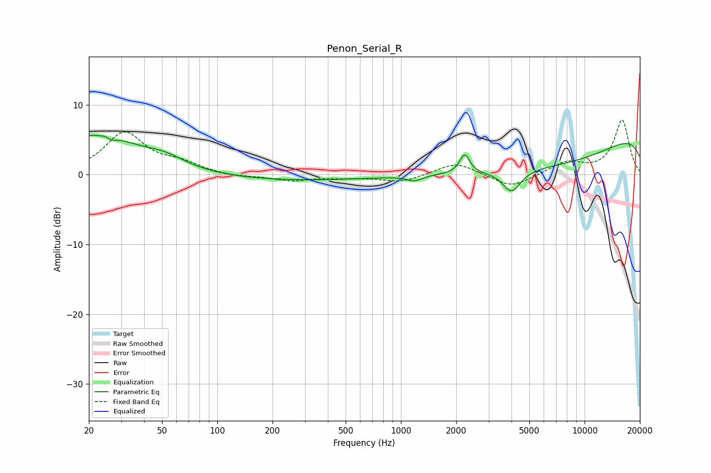

# Penon_Serial_R
See [usage instructions](https://github.com/jaakkopasanen/AutoEq#usage) for more options and info.

### Parametric EQs
Apply preamp of -5.7 dB when using parametric equalizer.

|   # | Type    |   Fc (Hz) |    Q |   Gain (dB) |
|-----|---------|-----------|------|-------------|
|   1 | Peaking |        21 | 0.45 |         5.7 |
|   2 | Peaking |        26 | 5.14 |         2.4 |
|   3 | Peaking |        26 | 5.4  |        -2.6 |
|   4 | Peaking |        53 | 1.51 |         0.9 |
|   5 | Peaking |       176 | 0.22 |        -0.9 |
|   6 | Peaking |      1185 | 3.16 |        -0.8 |
|   7 | Peaking |      2224 | 5.29 |         2.8 |
|   8 | Peaking |      4004 | 2.92 |        -3.1 |
|   9 | Peaking |      6567 | 0.28 |        -6.7 |
|  10 | Peaking |     10000 | 0.18 |         8.5 |

### Fixed Band EQs
When using fixed band (also called graphic) equalizer, apply preamp of **-7.9 dB** (if available) and set gains manually with these parameters.

|   # | Type    |   Fc (Hz) |    Q |   Gain (dB) |
|-----|---------|-----------|------|-------------|
|   1 | Peaking |        31 | 1.41 |         5.9 |
|   2 | Peaking |        62 | 1.41 |         1.4 |
|   3 | Peaking |       125 | 1.41 |        -0.3 |
|   4 | Peaking |       250 | 1.41 |        -0.8 |
|   5 | Peaking |       500 | 1.41 |        -0.3 |
|   6 | Peaking |      1000 | 1.41 |        -1.1 |
|   7 | Peaking |      2000 | 1.41 |         1.8 |
|   8 | Peaking |      4000 | 1.41 |        -2   |
|   9 | Peaking |      8000 | 1.41 |         1.7 |
|  10 | Peaking |     16000 | 1.41 |         7.8 |

### Graphs

