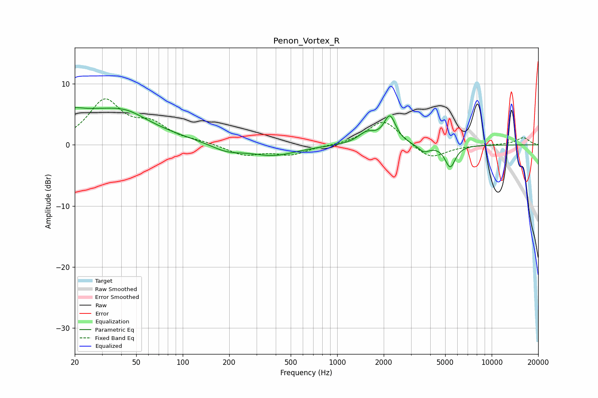

# Penon_Vortex_R
See [usage instructions](https://github.com/jaakkopasanen/AutoEq#usage) for more options and info.

### Parametric EQs
Apply preamp of -6.2 dB when using parametric equalizer.

|   # | Type    |   Fc (Hz) |    Q |   Gain (dB) |
|-----|---------|-----------|------|-------------|
|   1 | Peaking |        21 | 5.37 |         3.3 |
|   2 | Peaking |        21 | 5.9  |        -2.7 |
|   3 | Peaking |        25 | 0.39 |         5.4 |
|   4 | Peaking |        43 | 1.2  |         1.3 |
|   5 | Peaking |       193 | 1.38 |        -1.2 |
|   6 | Peaking |       386 | 0.95 |        -1.7 |
|   7 | Peaking |      1554 | 2.47 |         1.8 |
|   8 | Peaking |      2192 | 3.67 |         4.5 |
|   9 | Peaking |      3640 | 3.89 |        -1.2 |
|  10 | Peaking |      5389 | 4.18 |        -3.6 |

### Fixed Band EQs
When using fixed band (also called graphic) equalizer, apply preamp of **-7.6 dB** (if available) and set gains manually with these parameters.

|   # | Type    |   Fc (Hz) |    Q |   Gain (dB) |
|-----|---------|-----------|------|-------------|
|   1 | Peaking |        31 | 1.41 |         7   |
|   2 | Peaking |        62 | 1.41 |         2.9 |
|   3 | Peaking |       125 | 1.41 |         0.4 |
|   4 | Peaking |       250 | 1.41 |        -1.7 |
|   5 | Peaking |       500 | 1.41 |        -1.5 |
|   6 | Peaking |      1000 | 1.41 |        -0.1 |
|   7 | Peaking |      2000 | 1.41 |         4.2 |
|   8 | Peaking |      4000 | 1.41 |        -2.5 |
|   9 | Peaking |      8000 | 1.41 |        -0   |
|  10 | Peaking |     16000 | 1.41 |         1.2 |

### Graphs

