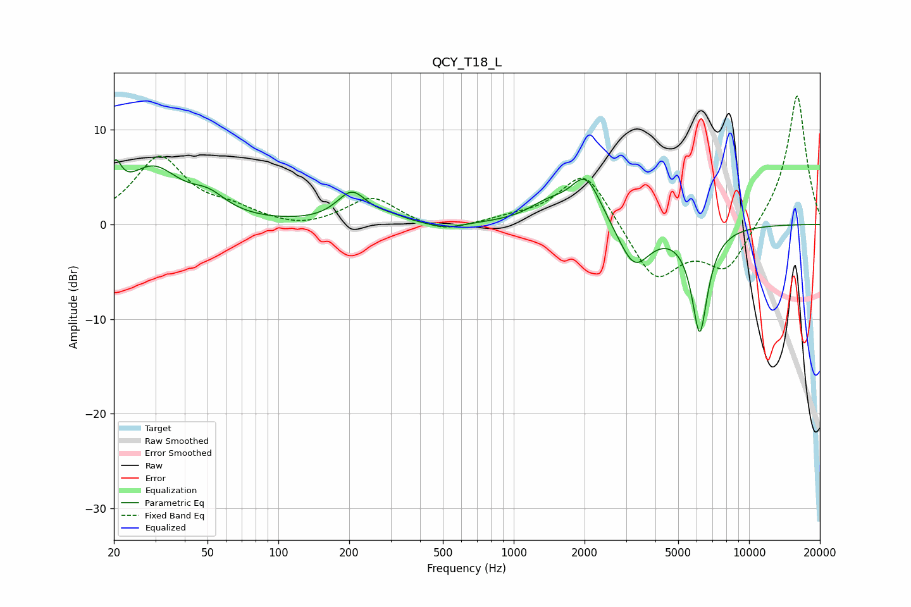

# QCY_T18_L
See [usage instructions](https://github.com/jaakkopasanen/AutoEq#usage) for more options and info.

### Parametric EQs
Apply preamp of -6.9 dB when using parametric equalizer.

|   # | Type    |   Fc (Hz) |    Q |   Gain (dB) |
|-----|---------|-----------|------|-------------|
|   1 | Peaking |        20 | 5.41 |         3.6 |
|   2 | Peaking |        29 | 1.2  |         5.6 |
|   3 | Peaking |        51 | 1.86 |         1.8 |
|   4 | Peaking |       205 | 2.22 |         3.2 |
|   5 | Peaking |       297 | 2.18 |         0.5 |
|   6 | Peaking |       513 | 1.9  |        -0.6 |
|   7 | Peaking |      1393 | 1.66 |         1.7 |
|   8 | Peaking |      2026 | 2.09 |         5   |
|   9 | Peaking |      3248 | 2.08 |        -4.7 |
|  10 | Peaking |      6171 | 3.95 |       -11.1 |

### Fixed Band EQs
When using fixed band (also called graphic) equalizer, apply preamp of **-13.7 dB** (if available) and set gains manually with these parameters.

|   # | Type    |   Fc (Hz) |    Q |   Gain (dB) |
|-----|---------|-----------|------|-------------|
|   1 | Peaking |        31 | 1.41 |         7   |
|   2 | Peaking |        62 | 1.41 |         1.3 |
|   3 | Peaking |       125 | 1.41 |        -0.6 |
|   4 | Peaking |       250 | 1.41 |         2.9 |
|   5 | Peaking |       500 | 1.41 |        -1   |
|   6 | Peaking |      1000 | 1.41 |         0.5 |
|   7 | Peaking |      2000 | 1.41 |         5.9 |
|   8 | Peaking |      4000 | 1.41 |        -6   |
|   9 | Peaking |      8000 | 1.41 |        -4.8 |
|  10 | Peaking |     16000 | 1.41 |        14   |

### Graphs

