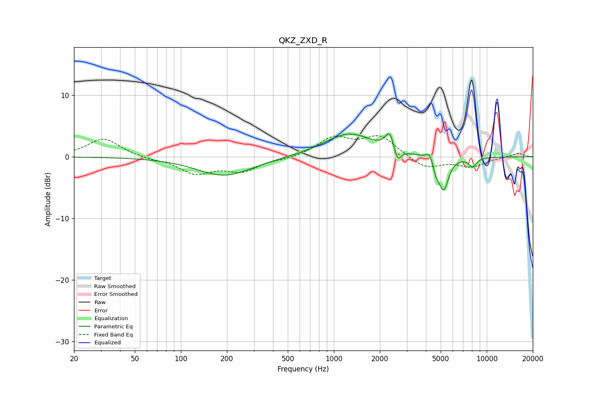

# QKZ_ZXD_R
See [usage instructions](https://github.com/jaakkopasanen/AutoEq#usage) for more options and info.

### Parametric EQs
Apply preamp of -3.9 dB when using parametric equalizer.

|   # | Type    |   Fc (Hz) |    Q |   Gain (dB) |
|-----|---------|-----------|------|-------------|
|   1 | Peaking |       193 | 0.79 |        -3.1 |
|   2 | Peaking |      1059 | 0.89 |         0.2 |
|   3 | Peaking |      1268 | 0.89 |         3.6 |
|   4 | Peaking |      2269 | 4.5  |         1   |
|   5 | Peaking |      2334 | 5.87 |         2   |
|   6 | Peaking |      2609 | 6    |        -2.3 |
|   7 | Peaking |      4260 | 5.97 |         1.7 |
|   8 | Peaking |      4644 | 6    |        -2   |
|   9 | Peaking |      5234 | 4.35 |        -5.2 |
|  10 | Peaking |      8087 | 5.05 |        -1.5 |

### Fixed Band EQs
When using fixed band (also called graphic) equalizer, apply preamp of **-3.5 dB** (if available) and set gains manually with these parameters.

|   # | Type    |   Fc (Hz) |    Q |   Gain (dB) |
|-----|---------|-----------|------|-------------|
|   1 | Peaking |        31 | 1.41 |         3   |
|   2 | Peaking |        62 | 1.41 |        -0.3 |
|   3 | Peaking |       125 | 1.41 |        -2.6 |
|   4 | Peaking |       250 | 1.41 |        -2.2 |
|   5 | Peaking |       500 | 1.41 |        -0.3 |
|   6 | Peaking |      1000 | 1.41 |         3   |
|   7 | Peaking |      2000 | 1.41 |         3.3 |
|   8 | Peaking |      4000 | 1.41 |        -1.9 |
|   9 | Peaking |      8000 | 1.41 |        -1.5 |
|  10 | Peaking |     16000 | 1.41 |         0.6 |

### Graphs

