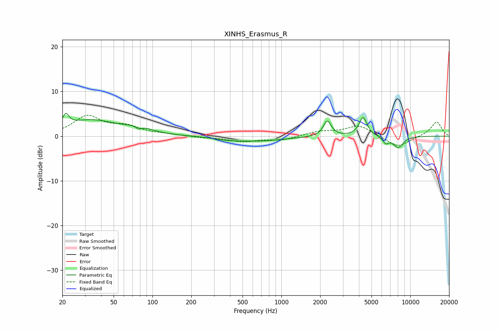

# XINHS_Erasmus_R
See [usage instructions](https://github.com/jaakkopasanen/AutoEq#usage) for more options and info.

### Parametric EQs
Apply preamp of -5.2 dB when using parametric equalizer.

|   # | Type    |   Fc (Hz) |    Q |   Gain (dB) |
|-----|---------|-----------|------|-------------|
|   1 | Peaking |        21 | 6    |         2.5 |
|   2 | Peaking |        33 | 0.66 |         3.5 |
|   3 | Peaking |        78 | 5.95 |        -0.9 |
|   4 | Peaking |        78 | 1.72 |         1.2 |
|   5 | Peaking |       376 | 1.87 |        -0.4 |
|   6 | Peaking |       643 | 0.68 |        -1.1 |
|   7 | Peaking |      2273 | 4.63 |         3.5 |
|   8 | Peaking |      4304 | 4.52 |         4.3 |
|   9 | Peaking |      6457 | 5.96 |        -1.4 |
|  10 | Peaking |      8054 | 3.35 |        -2.5 |

### Fixed Band EQs
When using fixed band (also called graphic) equalizer, apply preamp of **-4.8 dB** (if available) and set gains manually with these parameters.

|   # | Type    |   Fc (Hz) |    Q |   Gain (dB) |
|-----|---------|-----------|------|-------------|
|   1 | Peaking |        31 | 1.41 |         4.3 |
|   2 | Peaking |        62 | 1.41 |         1.9 |
|   3 | Peaking |       125 | 1.41 |         0.3 |
|   4 | Peaking |       250 | 1.41 |        -0.3 |
|   5 | Peaking |       500 | 1.41 |        -1.2 |
|   6 | Peaking |      1000 | 1.41 |        -0.8 |
|   7 | Peaking |      2000 | 1.41 |         1   |
|   8 | Peaking |      4000 | 1.41 |         2.4 |
|   9 | Peaking |      8000 | 1.41 |        -2.6 |
|  10 | Peaking |     16000 | 1.41 |         3.3 |

### Graphs

