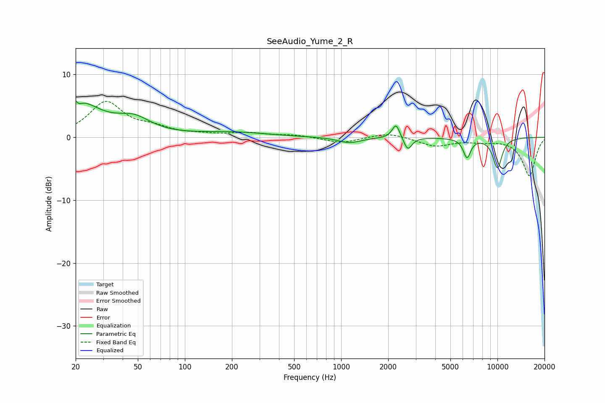

# SeeAudio_Yume_2_R
See [usage instructions](https://github.com/jaakkopasanen/AutoEq#usage) for more options and info.

### Parametric EQs
Apply preamp of -5.9 dB when using parametric equalizer.

|   # | Type    |   Fc (Hz) |    Q |   Gain (dB) |
|-----|---------|-----------|------|-------------|
|   1 | Peaking |        20 | 0.97 |         5.6 |
|   2 | Peaking |        20 | 5.99 |         2.4 |
|   3 | Peaking |        20 | 5.78 |        -2.6 |
|   4 | Peaking |        47 | 1.31 |         2.3 |
|   5 | Peaking |       201 | 0.63 |         0.8 |
|   6 | Peaking |      1130 | 1.93 |        -0.9 |
|   7 | Peaking |      2245 | 5.91 |         2.3 |
|   8 | Peaking |      2668 | 5.55 |        -2.1 |
|   9 | Peaking |      6388 | 5.75 |        -3   |
|  10 | Peaking |     10000 | 4.02 |        -4.8 |

### Fixed Band EQs
When using fixed band (also called graphic) equalizer, apply preamp of **-5.8 dB** (if available) and set gains manually with these parameters.

|   # | Type    |   Fc (Hz) |    Q |   Gain (dB) |
|-----|---------|-----------|------|-------------|
|   1 | Peaking |        31 | 1.41 |         5.5 |
|   2 | Peaking |        62 | 1.41 |         1.2 |
|   3 | Peaking |       125 | 1.41 |         0.3 |
|   4 | Peaking |       250 | 1.41 |         0.6 |
|   5 | Peaking |       500 | 1.41 |         0.4 |
|   6 | Peaking |      1000 | 1.41 |        -0.9 |
|   7 | Peaking |      2000 | 1.41 |         0.8 |
|   8 | Peaking |      4000 | 1.41 |        -1.4 |
|   9 | Peaking |      8000 | 1.41 |        -0.5 |
|  10 | Peaking |     16000 | 1.41 |        -6.1 |

### Graphs

