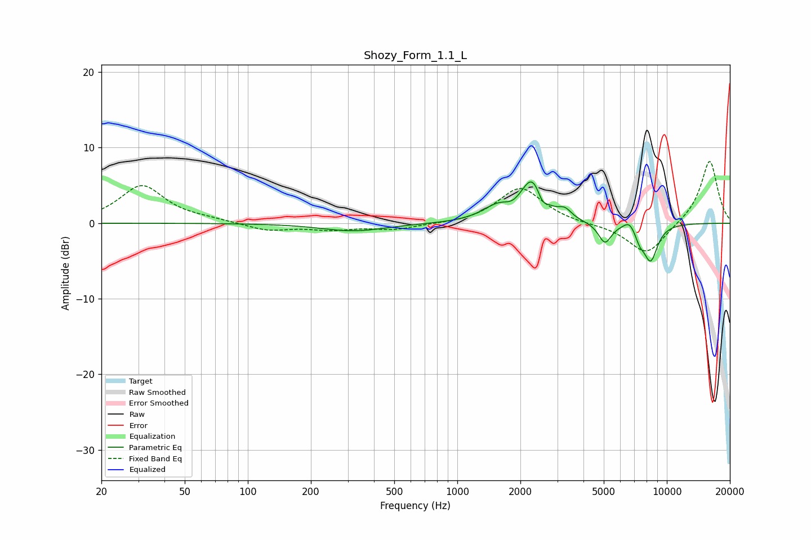

# Shozy_Form_1.1_L
See [usage instructions](https://github.com/jaakkopasanen/AutoEq#usage) for more options and info.

### Parametric EQs
Apply preamp of -5.6 dB when using parametric equalizer.

|   # | Type    |   Fc (Hz) |    Q |   Gain (dB) |
|-----|---------|-----------|------|-------------|
|   1 | Peaking |       320 | 0.93 |        -1   |
|   2 | Peaking |      1571 | 1.86 |         1.9 |
|   3 | Peaking |      1829 | 4.02 |        -0.6 |
|   4 | Peaking |      2286 | 2.6  |         5.5 |
|   5 | Peaking |      2541 | 6    |        -1.5 |
|   6 | Peaking |      3266 | 4.65 |         1.1 |
|   7 | Peaking |      5064 | 4.47 |        -2.7 |
|   8 | Peaking |      6624 | 4.96 |         1.1 |
|   9 | Peaking |      7427 | 6    |        -1.4 |
|  10 | Peaking |      8361 | 3.81 |        -4.8 |

### Fixed Band EQs
When using fixed band (also called graphic) equalizer, apply preamp of **-8.3 dB** (if available) and set gains manually with these parameters.

|   # | Type    |   Fc (Hz) |    Q |   Gain (dB) |
|-----|---------|-----------|------|-------------|
|   1 | Peaking |        31 | 1.41 |         5   |
|   2 | Peaking |        62 | 1.41 |         0.3 |
|   3 | Peaking |       125 | 1.41 |        -1   |
|   4 | Peaking |       250 | 1.41 |        -0.8 |
|   5 | Peaking |       500 | 1.41 |        -0.8 |
|   6 | Peaking |      1000 | 1.41 |        -0.2 |
|   7 | Peaking |      2000 | 1.41 |         4.8 |
|   8 | Peaking |      4000 | 1.41 |        -0.1 |
|   9 | Peaking |      8000 | 1.41 |        -4.2 |
|  10 | Peaking |     16000 | 1.41 |         8.4 |

### Graphs

