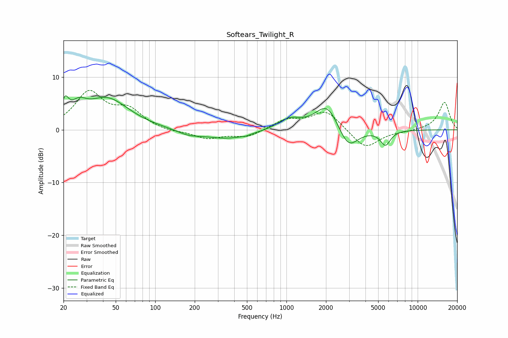

# Softears_Twilight_R
See [usage instructions](https://github.com/jaakkopasanen/AutoEq#usage) for more options and info.

### Parametric EQs
Apply preamp of -6.5 dB when using parametric equalizer.

|   # | Type    |   Fc (Hz) |    Q |   Gain (dB) |
|-----|---------|-----------|------|-------------|
|   1 | Peaking |        21 | 5.25 |         3.4 |
|   2 | Peaking |        26 | 2.48 |         2.5 |
|   3 | Peaking |        43 | 0.86 |         5.8 |
|   4 | Peaking |       179 | 1.64 |        -0.8 |
|   5 | Peaking |       356 | 0.77 |        -1.7 |
|   6 | Peaking |       490 | 5.95 |        -0.2 |
|   7 | Peaking |      1052 | 1.6  |         2   |
|   8 | Peaking |      2043 | 1.59 |         5.1 |
|   9 | Peaking |      2952 | 1.89 |        -4.4 |
|  10 | Peaking |      5678 | 3.61 |        -2.8 |

### Fixed Band EQs
When using fixed band (also called graphic) equalizer, apply preamp of **-7.6 dB** (if available) and set gains manually with these parameters.

|   # | Type    |   Fc (Hz) |    Q |   Gain (dB) |
|-----|---------|-----------|------|-------------|
|   1 | Peaking |        31 | 1.41 |         6.9 |
|   2 | Peaking |        62 | 1.41 |         3.4 |
|   3 | Peaking |       125 | 1.41 |        -0.5 |
|   4 | Peaking |       250 | 1.41 |        -1.6 |
|   5 | Peaking |       500 | 1.41 |        -1.4 |
|   6 | Peaking |      1000 | 1.41 |         1.8 |
|   7 | Peaking |      2000 | 1.41 |         3.6 |
|   8 | Peaking |      4000 | 1.41 |        -3.7 |
|   9 | Peaking |      8000 | 1.41 |        -0.2 |
|  10 | Peaking |     16000 | 1.41 |         5.2 |

### Graphs

