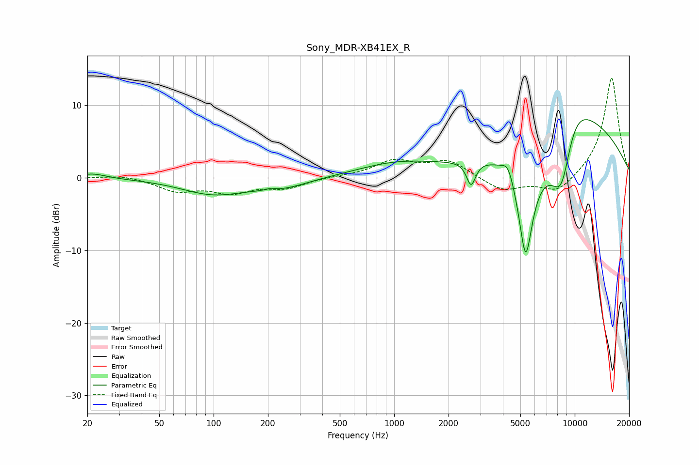

# Sony_MDR-XB41EX_R
See [usage instructions](https://github.com/jaakkopasanen/AutoEq#usage) for more options and info.

### Parametric EQs
Apply preamp of -8.1 dB when using parametric equalizer.

|   # | Type    |   Fc (Hz) |    Q |   Gain (dB) |
|-----|---------|-----------|------|-------------|
|   1 | Peaking |        21 | 1.95 |         0.7 |
|   2 | Peaking |        99 | 0.81 |        -2.1 |
|   3 | Peaking |       207 | 5.3  |         0.3 |
|   4 | Peaking |       237 | 0.96 |        -1.2 |
|   5 | Peaking |      1026 | 0.65 |         1.8 |
|   6 | Peaking |      2666 | 5.71 |        -3.3 |
|   7 | Peaking |      4277 | 4.28 |         2.1 |
|   8 | Peaking |      5350 | 3.13 |       -14.5 |
|   9 | Peaking |      8471 | 1.23 |       -17.5 |
|  10 | Peaking |      9566 | 0.61 |        19.7 |

### Fixed Band EQs
When using fixed band (also called graphic) equalizer, apply preamp of **-13.8 dB** (if available) and set gains manually with these parameters.

|   # | Type    |   Fc (Hz) |    Q |   Gain (dB) |
|-----|---------|-----------|------|-------------|
|   1 | Peaking |        31 | 1.41 |         0.4 |
|   2 | Peaking |        62 | 1.41 |        -1.7 |
|   3 | Peaking |       125 | 1.41 |        -1.8 |
|   4 | Peaking |       250 | 1.41 |        -1.3 |
|   5 | Peaking |       500 | 1.41 |         0.2 |
|   6 | Peaking |      1000 | 1.41 |         2.2 |
|   7 | Peaking |      2000 | 1.41 |         2.3 |
|   8 | Peaking |      4000 | 1.41 |        -1.9 |
|   9 | Peaking |      8000 | 1.41 |        -2.2 |
|  10 | Peaking |     16000 | 1.41 |        14   |

### Graphs

