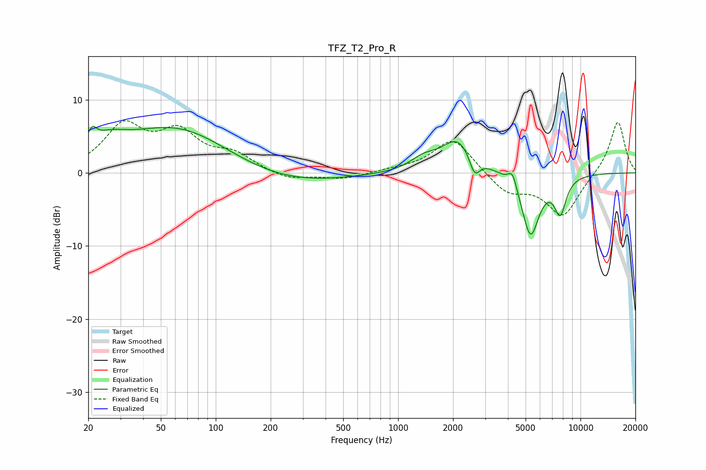

# TFZ_T2_Pro_R
See [usage instructions](https://github.com/jaakkopasanen/AutoEq#usage) for more options and info.

### Parametric EQs
Apply preamp of -6.4 dB when using parametric equalizer.

|   # | Type    |   Fc (Hz) |    Q |   Gain (dB) |
|-----|---------|-----------|------|-------------|
|   1 | Peaking |        21 | 5.91 |         1.9 |
|   2 | Peaking |        25 | 1.33 |         2.3 |
|   3 | Peaking |        63 | 0.46 |         6.5 |
|   4 | Peaking |       211 | 0.43 |        -2.1 |
|   5 | Peaking |      1371 | 2.04 |         1.4 |
|   6 | Peaking |      2138 | 1.52 |         4.7 |
|   7 | Peaking |      2626 | 4.84 |        -2.9 |
|   8 | Peaking |      4233 | 6    |         2.1 |
|   9 | Peaking |      5321 | 2.86 |        -8.6 |
|  10 | Peaking |      7741 | 4.12 |        -4.8 |

### Fixed Band EQs
When using fixed band (also called graphic) equalizer, apply preamp of **-7.2 dB** (if available) and set gains manually with these parameters.

|   # | Type    |   Fc (Hz) |    Q |   Gain (dB) |
|-----|---------|-----------|------|-------------|
|   1 | Peaking |        31 | 1.41 |         6.1 |
|   2 | Peaking |        62 | 1.41 |         4.9 |
|   3 | Peaking |       125 | 1.41 |         2.2 |
|   4 | Peaking |       250 | 1.41 |        -1   |
|   5 | Peaking |       500 | 1.41 |        -0.9 |
|   6 | Peaking |      1000 | 1.41 |         0.3 |
|   7 | Peaking |      2000 | 1.41 |         4.8 |
|   8 | Peaking |      4000 | 1.41 |        -2.7 |
|   9 | Peaking |      8000 | 1.41 |        -5.9 |
|  10 | Peaking |     16000 | 1.41 |         7.3 |

### Graphs

