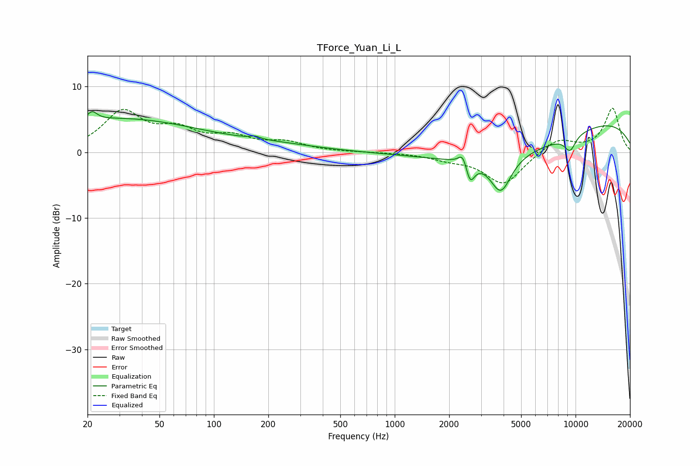

# TForce_Yuan_Li_L
See [usage instructions](https://github.com/jaakkopasanen/AutoEq#usage) for more options and info.

### Parametric EQs
Apply preamp of -6.3 dB when using parametric equalizer.

|   # | Type    |   Fc (Hz) |    Q |   Gain (dB) |
|-----|---------|-----------|------|-------------|
|   1 | Peaking |        21 | 5.13 |         1.4 |
|   2 | Peaking |        30 | 0.31 |         5   |
|   3 | Peaking |       169 | 5.76 |         0.4 |
|   4 | Peaking |       214 | 0.55 |         0.9 |
|   5 | Peaking |      2385 | 6    |         2   |
|   6 | Peaking |      2609 | 5.76 |        -3.2 |
|   7 | Peaking |      3862 | 2.45 |        -5.6 |
|   8 | Peaking |      4858 | 0.35 |        -4.5 |
|   9 | Peaking |      9328 | 4.1  |        -2.3 |
|  10 | Peaking |     10000 | 0.23 |         6.1 |

### Fixed Band EQs
When using fixed band (also called graphic) equalizer, apply preamp of **-6.8 dB** (if available) and set gains manually with these parameters.

|   # | Type    |   Fc (Hz) |    Q |   Gain (dB) |
|-----|---------|-----------|------|-------------|
|   1 | Peaking |        31 | 1.41 |         5.9 |
|   2 | Peaking |        62 | 1.41 |         2.9 |
|   3 | Peaking |       125 | 1.41 |         2   |
|   4 | Peaking |       250 | 1.41 |         1.3 |
|   5 | Peaking |       500 | 1.41 |         0   |
|   6 | Peaking |      1000 | 1.41 |        -0   |
|   7 | Peaking |      2000 | 1.41 |        -0.8 |
|   8 | Peaking |      4000 | 1.41 |        -4.9 |
|   9 | Peaking |      8000 | 1.41 |         2.1 |
|  10 | Peaking |     16000 | 1.41 |         6.7 |

### Graphs

