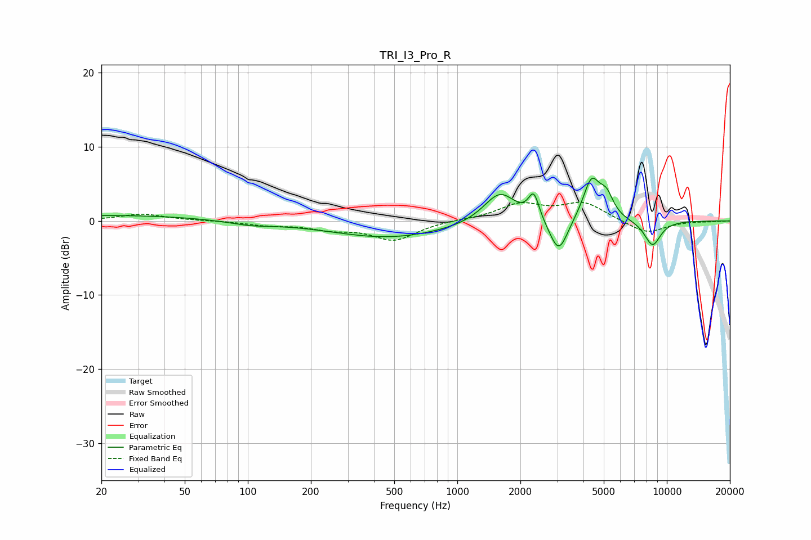

# TRI_I3_Pro_R
See [usage instructions](https://github.com/jaakkopasanen/AutoEq#usage) for more options and info.

### Parametric EQs
Apply preamp of -5.9 dB when using parametric equalizer.

|   # | Type    |   Fc (Hz) |    Q |   Gain (dB) |
|-----|---------|-----------|------|-------------|
|   1 | Peaking |        24 | 0.34 |         0.8 |
|   2 | Peaking |       103 | 1.31 |        -0.5 |
|   3 | Peaking |       473 | 0.51 |        -2.2 |
|   4 | Peaking |      1598 | 1.8  |         4.5 |
|   5 | Peaking |      1674 | 1.1  |        -0.3 |
|   6 | Peaking |      2318 | 5.56 |         3.5 |
|   7 | Peaking |      3048 | 3.23 |        -4.8 |
|   8 | Peaking |      4370 | 3.42 |         5.5 |
|   9 | Peaking |      5151 | 4.12 |         2.7 |
|  10 | Peaking |      8546 | 3.25 |        -3.4 |

### Fixed Band EQs
When using fixed band (also called graphic) equalizer, apply preamp of **-2.6 dB** (if available) and set gains manually with these parameters.

|   # | Type    |   Fc (Hz) |    Q |   Gain (dB) |
|-----|---------|-----------|------|-------------|
|   1 | Peaking |        31 | 1.41 |         0.9 |
|   2 | Peaking |        62 | 1.41 |         0   |
|   3 | Peaking |       125 | 1.41 |        -0.5 |
|   4 | Peaking |       250 | 1.41 |        -0.9 |
|   5 | Peaking |       500 | 1.41 |        -2.5 |
|   6 | Peaking |      1000 | 1.41 |         0.1 |
|   7 | Peaking |      2000 | 1.41 |         2.2 |
|   8 | Peaking |      4000 | 1.41 |         2.4 |
|   9 | Peaking |      8000 | 1.41 |        -1.8 |
|  10 | Peaking |     16000 | 1.41 |        -0.1 |

### Graphs

