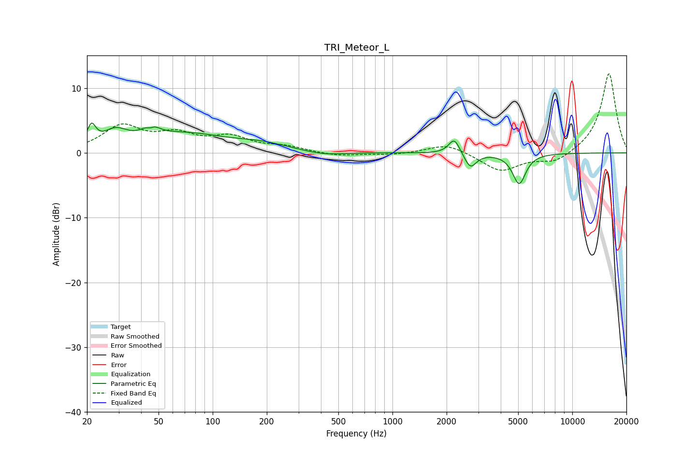

# TRI_Meteor_L
See [usage instructions](https://github.com/jaakkopasanen/AutoEq#usage) for more options and info.

### Parametric EQs
Apply preamp of -4.7 dB when using parametric equalizer.

|   # | Type    |   Fc (Hz) |    Q |   Gain (dB) |
|-----|---------|-----------|------|-------------|
|   1 | Peaking |        21 | 6    |         3   |
|   2 | Peaking |        29 | 2.07 |         2.4 |
|   3 | Peaking |        45 | 5.32 |        -2.6 |
|   4 | Peaking |        45 | 3.99 |         3.7 |
|   5 | Peaking |        70 | 0.61 |         2.8 |
|   6 | Peaking |       188 | 0.94 |         1   |
|   7 | Peaking |       413 | 1.31 |        -0.6 |
|   8 | Peaking |      2207 | 4.65 |         2.4 |
|   9 | Peaking |      2711 | 4.37 |        -2.4 |
|  10 | Peaking |      5065 | 3.88 |        -4.7 |

### Fixed Band EQs
When using fixed band (also called graphic) equalizer, apply preamp of **-12.3 dB** (if available) and set gains manually with these parameters.

|   # | Type    |   Fc (Hz) |    Q |   Gain (dB) |
|-----|---------|-----------|------|-------------|
|   1 | Peaking |        31 | 1.41 |         3.9 |
|   2 | Peaking |        62 | 1.41 |         2.4 |
|   3 | Peaking |       125 | 1.41 |         2.2 |
|   4 | Peaking |       250 | 1.41 |         0.8 |
|   5 | Peaking |       500 | 1.41 |        -0.5 |
|   6 | Peaking |      1000 | 1.41 |        -0.3 |
|   7 | Peaking |      2000 | 1.41 |         1.5 |
|   8 | Peaking |      4000 | 1.41 |        -2.8 |
|   9 | Peaking |      8000 | 1.41 |        -1.6 |
|  10 | Peaking |     16000 | 1.41 |        12.4 |

### Graphs

