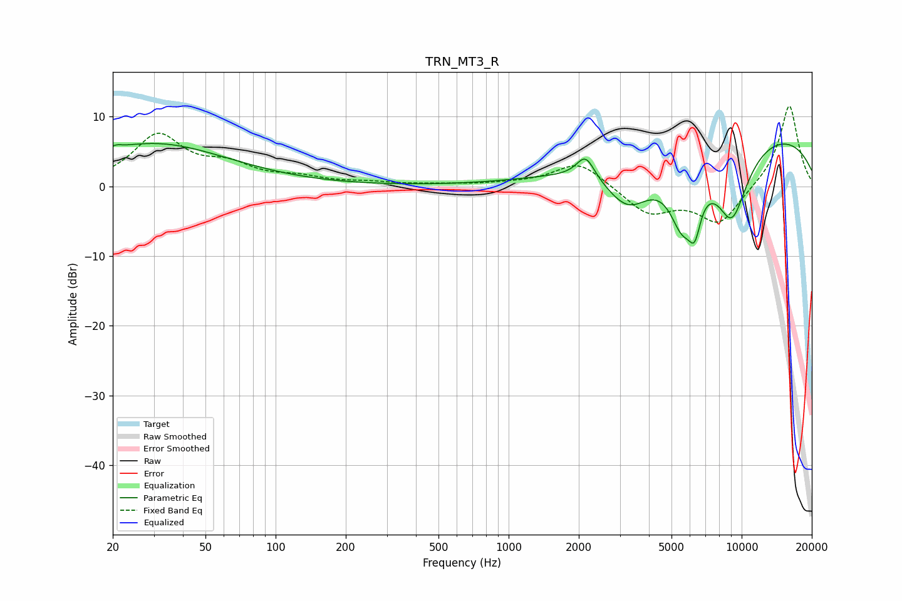

# TRN_MT3_R
See [usage instructions](https://github.com/jaakkopasanen/AutoEq#usage) for more options and info.

### Parametric EQs
Apply preamp of -6.3 dB when using parametric equalizer.

|   # | Type    |   Fc (Hz) |    Q |   Gain (dB) |
|-----|---------|-----------|------|-------------|
|   1 | Peaking |        21 | 5.85 |         0.5 |
|   2 | Peaking |        30 | 0.44 |         6.1 |
|   3 | Peaking |      2139 | 3.66 |         3.4 |
|   4 | Peaking |      2997 | 0.76 |         0.5 |
|   5 | Peaking |      3269 | 1.28 |        -7.4 |
|   6 | Peaking |      5538 | 2.35 |        -8.4 |
|   7 | Peaking |      6215 | 4.48 |        -2.5 |
|   8 | Peaking |      6323 | 5.92 |        -2.8 |
|   9 | Peaking |      9074 | 1.63 |       -11.4 |
|  10 | Peaking |      9676 | 0.21 |         8.6 |

### Fixed Band EQs
When using fixed band (also called graphic) equalizer, apply preamp of **-11.6 dB** (if available) and set gains manually with these parameters.

|   # | Type    |   Fc (Hz) |    Q |   Gain (dB) |
|-----|---------|-----------|------|-------------|
|   1 | Peaking |        31 | 1.41 |         7.1 |
|   2 | Peaking |        62 | 1.41 |         2.5 |
|   3 | Peaking |       125 | 1.41 |         1   |
|   4 | Peaking |       250 | 1.41 |         0.4 |
|   5 | Peaking |       500 | 1.41 |         0.2 |
|   6 | Peaking |      1000 | 1.41 |         0.3 |
|   7 | Peaking |      2000 | 1.41 |         3.6 |
|   8 | Peaking |      4000 | 1.41 |        -3.9 |
|   9 | Peaking |      8000 | 1.41 |        -5.4 |
|  10 | Peaking |     16000 | 1.41 |        11.9 |

### Graphs

