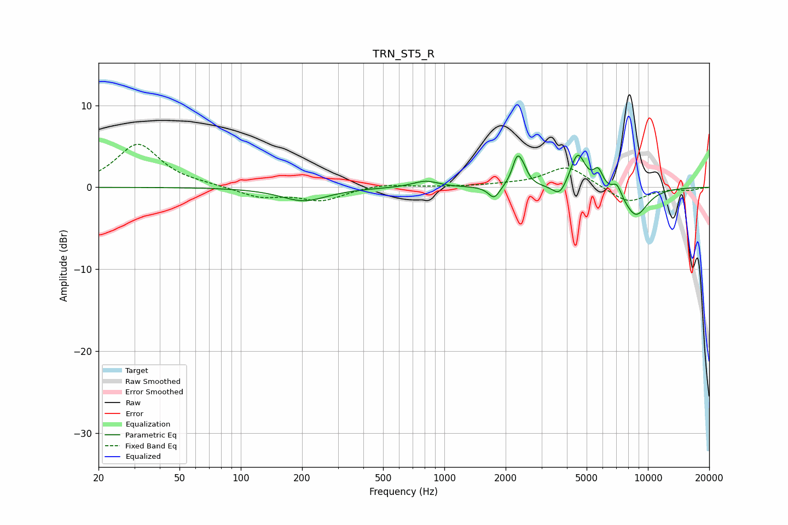

# TRN_ST5_R
See [usage instructions](https://github.com/jaakkopasanen/AutoEq#usage) for more options and info.

### Parametric EQs
Apply preamp of -4.0 dB when using parametric equalizer.

|   # | Type    |   Fc (Hz) |    Q |   Gain (dB) |
|-----|---------|-----------|------|-------------|
|   1 | Peaking |       204 | 1.24 |        -1.6 |
|   2 | Peaking |       808 | 2.26 |         0.8 |
|   3 | Peaking |      1756 | 5.07 |        -1.6 |
|   4 | Peaking |      2279 | 5.95 |         3.2 |
|   5 | Peaking |      2446 | 5.97 |         1.3 |
|   6 | Peaking |      3691 | 4.01 |        -1.7 |
|   7 | Peaking |      4519 | 3.81 |         4.3 |
|   8 | Peaking |      5696 | 6    |         2   |
|   9 | Peaking |      7045 | 6    |         1.4 |
|  10 | Peaking |      8713 | 2.12 |        -3.6 |

### Fixed Band EQs
When using fixed band (also called graphic) equalizer, apply preamp of **-5.3 dB** (if available) and set gains manually with these parameters.

|   # | Type    |   Fc (Hz) |    Q |   Gain (dB) |
|-----|---------|-----------|------|-------------|
|   1 | Peaking |        31 | 1.41 |         5.3 |
|   2 | Peaking |        62 | 1.41 |         0.2 |
|   3 | Peaking |       125 | 1.41 |        -1.2 |
|   4 | Peaking |       250 | 1.41 |        -1.6 |
|   5 | Peaking |       500 | 1.41 |         0.4 |
|   6 | Peaking |      1000 | 1.41 |         0   |
|   7 | Peaking |      2000 | 1.41 |         0.2 |
|   8 | Peaking |      4000 | 1.41 |         2.6 |
|   9 | Peaking |      8000 | 1.41 |        -2   |
|  10 | Peaking |     16000 | 1.41 |        -0.3 |

### Graphs

