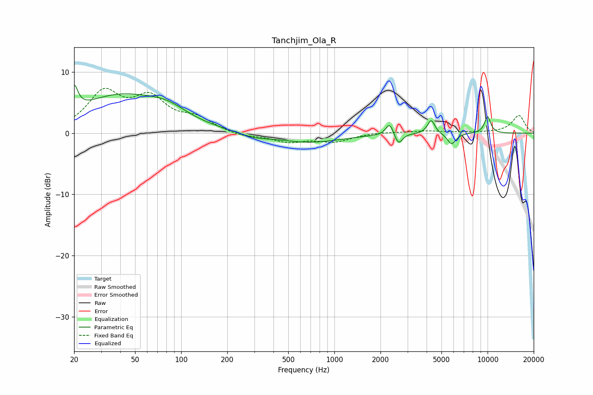

# Tanchjim_Ola_R
See [usage instructions](https://github.com/jaakkopasanen/AutoEq#usage) for more options and info.

### Parametric EQs
Apply preamp of -8.0 dB when using parametric equalizer.

|   # | Type    |   Fc (Hz) |    Q |   Gain (dB) |
|-----|---------|-----------|------|-------------|
|   1 | Peaking |        20 | 6    |         3.9 |
|   2 | Peaking |        40 | 0.49 |         5.9 |
|   3 | Peaking |        81 | 1.11 |         1.7 |
|   4 | Peaking |       298 | 1.5  |        -0.7 |
|   5 | Peaking |       683 | 0.65 |        -1.5 |
|   6 | Peaking |      2292 | 5.95 |         2   |
|   7 | Peaking |      2623 | 6    |        -1.8 |
|   8 | Peaking |      4284 | 5.89 |         2.3 |
|   9 | Peaking |      5824 | 4.86 |        -1.8 |
|  10 | Peaking |     10000 | 5.84 |         2.7 |

### Fixed Band EQs
When using fixed band (also called graphic) equalizer, apply preamp of **-7.4 dB** (if available) and set gains manually with these parameters.

|   # | Type    |   Fc (Hz) |    Q |   Gain (dB) |
|-----|---------|-----------|------|-------------|
|   1 | Peaking |        31 | 1.41 |         6.3 |
|   2 | Peaking |        62 | 1.41 |         5.1 |
|   3 | Peaking |       125 | 1.41 |         2   |
|   4 | Peaking |       250 | 1.41 |        -0.6 |
|   5 | Peaking |       500 | 1.41 |        -1.3 |
|   6 | Peaking |      1000 | 1.41 |        -1.3 |
|   7 | Peaking |      2000 | 1.41 |         0.2 |
|   8 | Peaking |      4000 | 1.41 |         0.3 |
|   9 | Peaking |      8000 | 1.41 |         0.1 |
|  10 | Peaking |     16000 | 1.41 |         2.9 |

### Graphs

