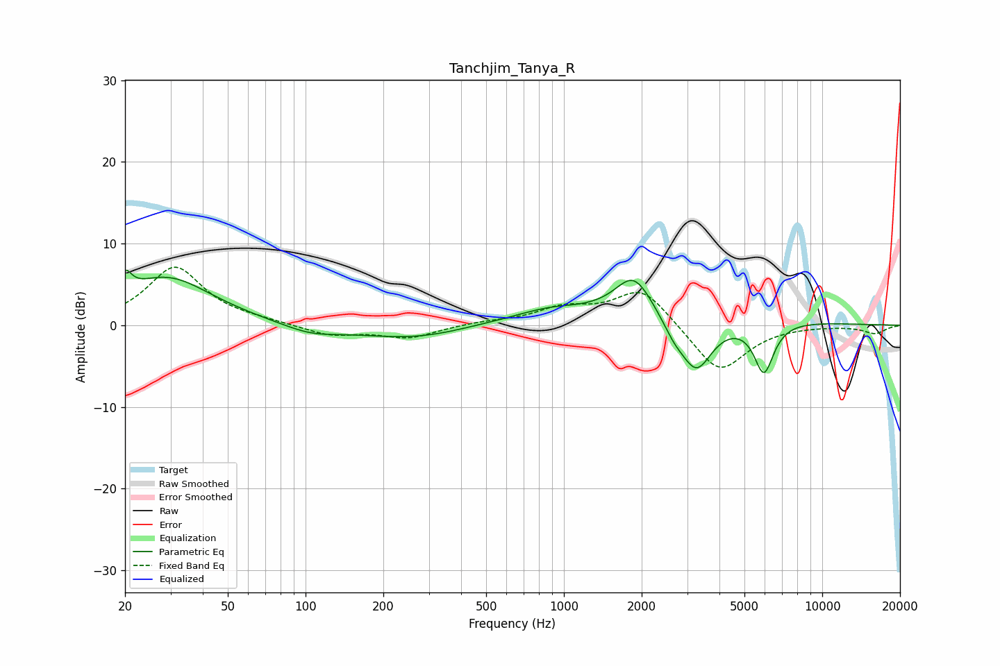

# Tanchjim_Tanya_R
See [usage instructions](https://github.com/jaakkopasanen/AutoEq#usage) for more options and info.

### Parametric EQs
Apply preamp of -6.8 dB when using parametric equalizer.

|   # | Type    |   Fc (Hz) |    Q |   Gain (dB) |
|-----|---------|-----------|------|-------------|
|   1 | Peaking |        20 | 5.83 |         2.6 |
|   2 | Peaking |        29 | 0.81 |         5.8 |
|   3 | Peaking |       105 | 1.29 |        -1.1 |
|   4 | Peaking |       269 | 0.64 |        -1.9 |
|   5 | Peaking |       884 | 1.22 |         0.9 |
|   6 | Peaking |      1737 | 0.22 |         1.6 |
|   7 | Peaking |      1864 | 1.97 |         4.9 |
|   8 | Peaking |      2664 | 3.12 |        -1.6 |
|   9 | Peaking |      3258 | 2.23 |        -6.6 |
|  10 | Peaking |      5945 | 3.6  |        -6.3 |

### Fixed Band EQs
When using fixed band (also called graphic) equalizer, apply preamp of **-7.2 dB** (if available) and set gains manually with these parameters.

|   # | Type    |   Fc (Hz) |    Q |   Gain (dB) |
|-----|---------|-----------|------|-------------|
|   1 | Peaking |        31 | 1.41 |         7.1 |
|   2 | Peaking |        62 | 1.41 |         0.3 |
|   3 | Peaking |       125 | 1.41 |        -1.3 |
|   4 | Peaking |       250 | 1.41 |        -1.5 |
|   5 | Peaking |       500 | 1.41 |         0.4 |
|   6 | Peaking |      1000 | 1.41 |         1.9 |
|   7 | Peaking |      2000 | 1.41 |         4.6 |
|   8 | Peaking |      4000 | 1.41 |        -6   |
|   9 | Peaking |      8000 | 1.41 |         0   |
|  10 | Peaking |     16000 | 1.41 |        -1   |

### Graphs

