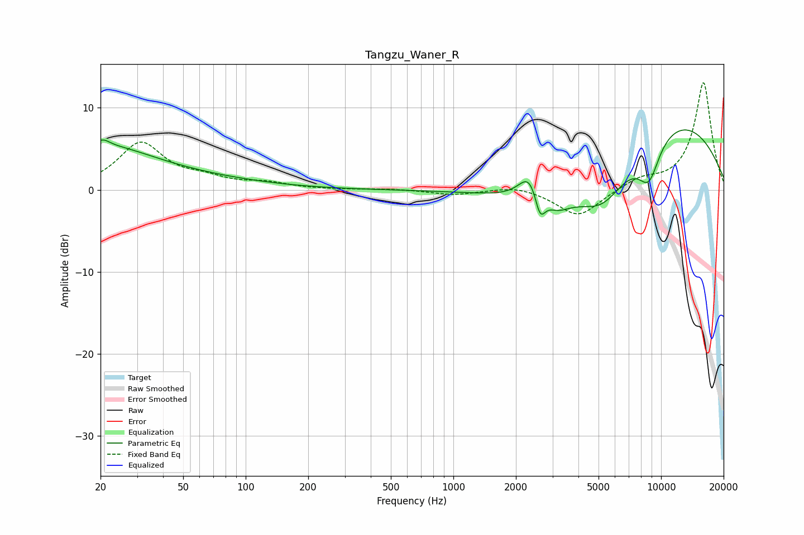

# Tangzu_Waner_R
See [usage instructions](https://github.com/jaakkopasanen/AutoEq#usage) for more options and info.

### Parametric EQs
Apply preamp of -7.4 dB when using parametric equalizer.

|   # | Type    |   Fc (Hz) |    Q |   Gain (dB) |
|-----|---------|-----------|------|-------------|
|   1 | Peaking |        21 | 4.43 |         0.8 |
|   2 | Peaking |        21 | 0.62 |         3.6 |
|   3 | Peaking |        27 | 0.25 |         1.7 |
|   4 | Peaking |      2334 | 2.84 |         3.3 |
|   5 | Peaking |      2613 | 5.66 |        -3.2 |
|   6 | Peaking |      3161 | 2.51 |        -1.3 |
|   7 | Peaking |      4903 | 0.47 |        -6.9 |
|   8 | Peaking |      5254 | 1.48 |        -2.4 |
|   9 | Peaking |      8740 | 2.45 |        -4.7 |
|  10 | Peaking |      9804 | 0.33 |        11.1 |

### Fixed Band EQs
When using fixed band (also called graphic) equalizer, apply preamp of **-13.1 dB** (if available) and set gains manually with these parameters.

|   # | Type    |   Fc (Hz) |    Q |   Gain (dB) |
|-----|---------|-----------|------|-------------|
|   1 | Peaking |        31 | 1.41 |         5.6 |
|   2 | Peaking |        62 | 1.41 |         1.1 |
|   3 | Peaking |       125 | 1.41 |         0.7 |
|   4 | Peaking |       250 | 1.41 |        -0   |
|   5 | Peaking |       500 | 1.41 |         0.1 |
|   6 | Peaking |      1000 | 1.41 |        -0.6 |
|   7 | Peaking |      2000 | 1.41 |         0.6 |
|   8 | Peaking |      4000 | 1.41 |        -3.3 |
|   9 | Peaking |      8000 | 1.41 |         1.2 |
|  10 | Peaking |     16000 | 1.41 |        13.1 |

### Graphs

