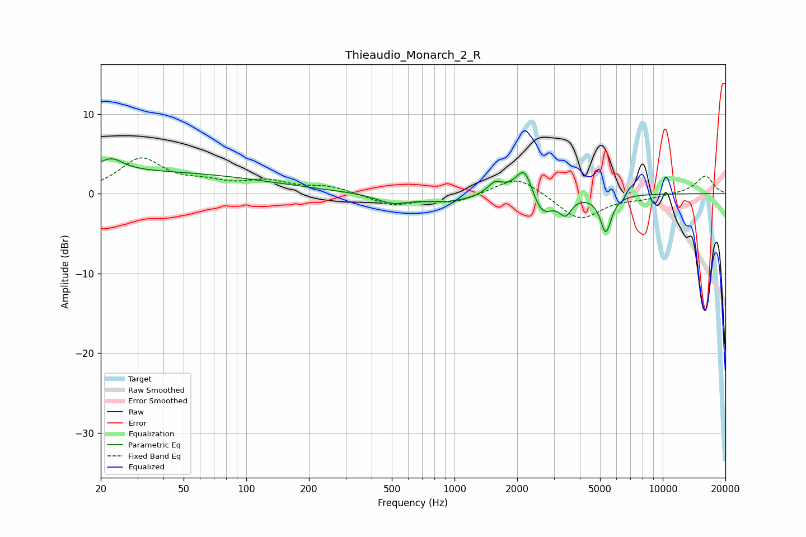

# Thieaudio_Monarch_2_R
See [usage instructions](https://github.com/jaakkopasanen/AutoEq#usage) for more options and info.

### Parametric EQs
Apply preamp of -4.5 dB when using parametric equalizer.

|   # | Type    |   Fc (Hz) |    Q |   Gain (dB) |
|-----|---------|-----------|------|-------------|
|   1 | Peaking |        22 | 2.45 |         1.6 |
|   2 | Peaking |        25 | 0.18 |         2.8 |
|   3 | Peaking |       503 | 1.82 |        -1.1 |
|   4 | Peaking |       928 | 1.1  |        -1   |
|   5 | Peaking |      1562 | 4.05 |         1.4 |
|   6 | Peaking |      2169 | 4.5  |         1.9 |
|   7 | Peaking |      2203 | 2.14 |         2.7 |
|   8 | Peaking |      2608 | 2.59 |        -3.7 |
|   9 | Peaking |      3411 | 4.96 |        -2   |
|  10 | Peaking |      5332 | 5.24 |        -4.6 |

### Fixed Band EQs
When using fixed band (also called graphic) equalizer, apply preamp of **-4.6 dB** (if available) and set gains manually with these parameters.

|   # | Type    |   Fc (Hz) |    Q |   Gain (dB) |
|-----|---------|-----------|------|-------------|
|   1 | Peaking |        31 | 1.41 |         4.2 |
|   2 | Peaking |        62 | 1.41 |         1.1 |
|   3 | Peaking |       125 | 1.41 |         1.4 |
|   4 | Peaking |       250 | 1.41 |         0.9 |
|   5 | Peaking |       500 | 1.41 |        -1.4 |
|   6 | Peaking |      1000 | 1.41 |        -1.1 |
|   7 | Peaking |      2000 | 1.41 |         2.4 |
|   8 | Peaking |      4000 | 1.41 |        -3.3 |
|   9 | Peaking |      8000 | 1.41 |        -0.5 |
|  10 | Peaking |     16000 | 1.41 |         2.3 |

### Graphs

