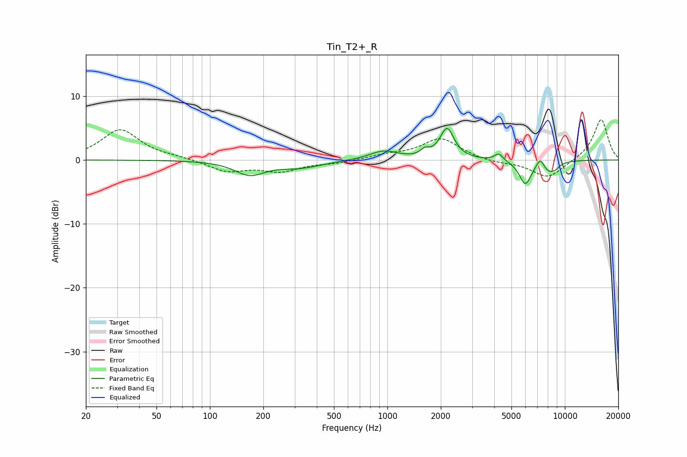

# Tin_T2+_R
See [usage instructions](https://github.com/jaakkopasanen/AutoEq#usage) for more options and info.

### Parametric EQs
Apply preamp of -5.0 dB when using parametric equalizer.

|   # | Type    |   Fc (Hz) |    Q |   Gain (dB) |
|-----|---------|-----------|------|-------------|
|   1 | Peaking |       168 | 1.7  |        -2.1 |
|   2 | Peaking |       321 | 1.11 |        -1.1 |
|   3 | Peaking |       952 | 1.76 |         1.4 |
|   4 | Peaking |      1628 | 6    |         0.9 |
|   5 | Peaking |      2168 | 3.63 |         4.8 |
|   6 | Peaking |      4242 | 6    |         1.1 |
|   7 | Peaking |      5992 | 4    |        -3.7 |
|   8 | Peaking |      7277 | 5.96 |         1.6 |
|   9 | Peaking |      8050 | 3.42 |        -1.5 |
|  10 | Peaking |      8829 | 4.97 |        -0.7 |

### Fixed Band EQs
When using fixed band (also called graphic) equalizer, apply preamp of **-6.4 dB** (if available) and set gains manually with these parameters.

|   # | Type    |   Fc (Hz) |    Q |   Gain (dB) |
|-----|---------|-----------|------|-------------|
|   1 | Peaking |        31 | 1.41 |         4.7 |
|   2 | Peaking |        62 | 1.41 |         0.3 |
|   3 | Peaking |       125 | 1.41 |        -1.7 |
|   4 | Peaking |       250 | 1.41 |        -1.6 |
|   5 | Peaking |       500 | 1.41 |        -0.4 |
|   6 | Peaking |      1000 | 1.41 |         0.7 |
|   7 | Peaking |      2000 | 1.41 |         3.4 |
|   8 | Peaking |      4000 | 1.41 |        -0.5 |
|   9 | Peaking |      8000 | 1.41 |        -2.9 |
|  10 | Peaking |     16000 | 1.41 |         6.5 |

### Graphs

