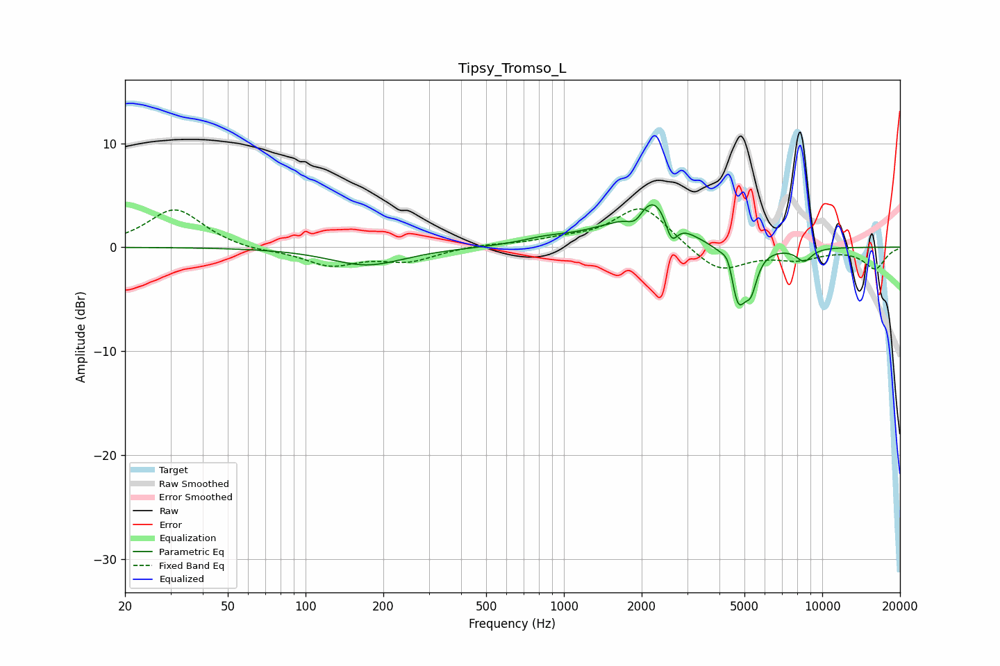

# Tipsy_Tromso_L
See [usage instructions](https://github.com/jaakkopasanen/AutoEq#usage) for more options and info.

### Parametric EQs
Apply preamp of -4.2 dB when using parametric equalizer.

|   # | Type    |   Fc (Hz) |    Q |   Gain (dB) |
|-----|---------|-----------|------|-------------|
|   1 | Peaking |       173 | 0.98 |        -1.7 |
|   2 | Peaking |       846 | 1.5  |         0.5 |
|   3 | Peaking |      1529 | 0.95 |         1.2 |
|   4 | Peaking |      1893 | 4.41 |        -1.3 |
|   5 | Peaking |      2235 | 1.81 |         4.4 |
|   6 | Peaking |      2609 | 5.92 |        -2.6 |
|   7 | Peaking |      4351 | 6    |         2   |
|   8 | Peaking |      4704 | 4.23 |        -6   |
|   9 | Peaking |      5307 | 6    |        -2.7 |
|  10 | Peaking |      8508 | 4.24 |        -1.3 |

### Fixed Band EQs
When using fixed band (also called graphic) equalizer, apply preamp of **-3.8 dB** (if available) and set gains manually with these parameters.

|   # | Type    |   Fc (Hz) |    Q |   Gain (dB) |
|-----|---------|-----------|------|-------------|
|   1 | Peaking |        31 | 1.41 |         3.7 |
|   2 | Peaking |        62 | 1.41 |        -0.4 |
|   3 | Peaking |       125 | 1.41 |        -1.7 |
|   4 | Peaking |       250 | 1.41 |        -1.2 |
|   5 | Peaking |       500 | 1.41 |         0.3 |
|   6 | Peaking |      1000 | 1.41 |         0.6 |
|   7 | Peaking |      2000 | 1.41 |         4   |
|   8 | Peaking |      4000 | 1.41 |        -2.5 |
|   9 | Peaking |      8000 | 1.41 |        -1   |
|  10 | Peaking |     16000 | 1.41 |        -2   |

### Graphs

