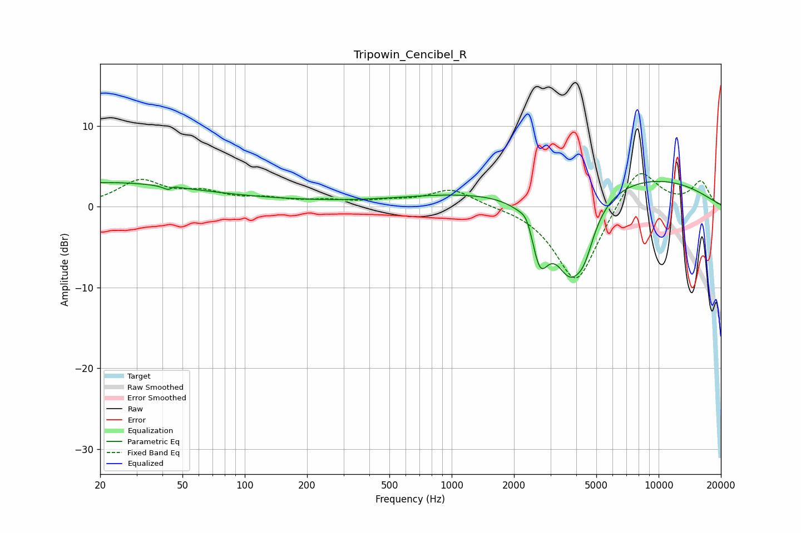

# Tripowin_Cencibel_R
See [usage instructions](https://github.com/jaakkopasanen/AutoEq#usage) for more options and info.

### Parametric EQs
Apply preamp of -3.2 dB when using parametric equalizer.

|   # | Type    |   Fc (Hz) |    Q |   Gain (dB) |
|-----|---------|-----------|------|-------------|
|   1 | Peaking |        20 | 0.34 |         2.8 |
|   2 | Peaking |        44 | 5.91 |        -2.1 |
|   3 | Peaking |        44 | 5.98 |         1.8 |
|   4 | Peaking |       112 | 0.37 |         0.6 |
|   5 | Peaking |       975 | 0.47 |         1.2 |
|   6 | Peaking |      2315 | 4.74 |         1.6 |
|   7 | Peaking |      2666 | 3.28 |        -6.5 |
|   8 | Peaking |      3728 | 1.64 |        -9.9 |
|   9 | Peaking |      4387 | 3.1  |        -3.1 |
|  10 | Peaking |      6969 | 0.3  |         4   |

### Fixed Band EQs
When using fixed band (also called graphic) equalizer, apply preamp of **-4.2 dB** (if available) and set gains manually with these parameters.

|   # | Type    |   Fc (Hz) |    Q |   Gain (dB) |
|-----|---------|-----------|------|-------------|
|   1 | Peaking |        31 | 1.41 |         3.1 |
|   2 | Peaking |        62 | 1.41 |         1.5 |
|   3 | Peaking |       125 | 1.41 |         0.8 |
|   4 | Peaking |       250 | 1.41 |         0.6 |
|   5 | Peaking |       500 | 1.41 |         0.5 |
|   6 | Peaking |      1000 | 1.41 |         2.2 |
|   7 | Peaking |      2000 | 1.41 |         0.1 |
|   8 | Peaking |      4000 | 1.41 |        -9.7 |
|   9 | Peaking |      8000 | 1.41 |         5.4 |
|  10 | Peaking |     16000 | 1.41 |         3   |

### Graphs

