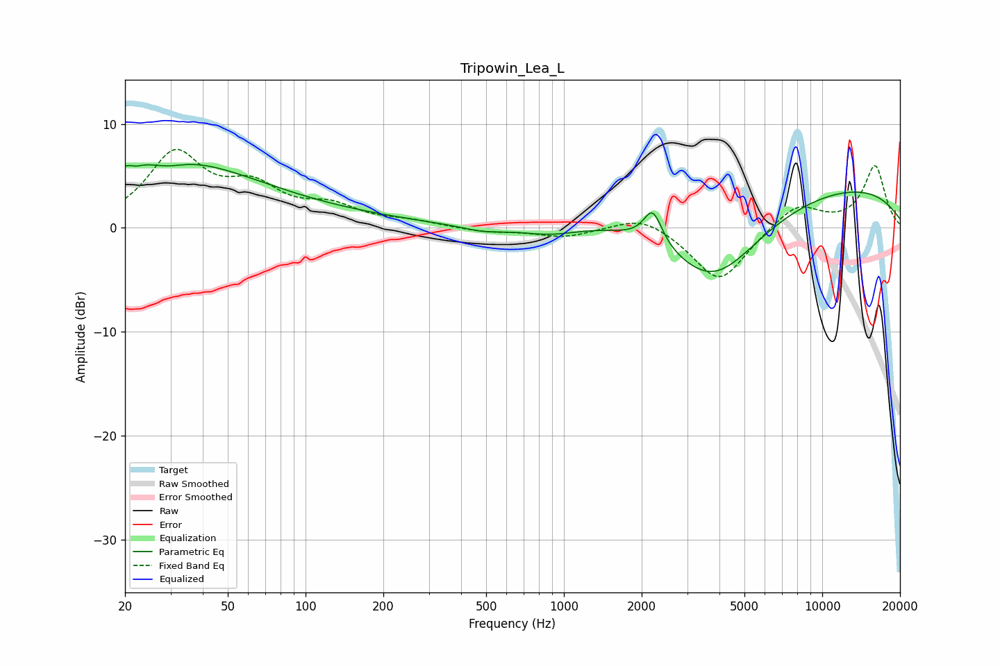

# Tripowin_Lea_L
See [usage instructions](https://github.com/jaakkopasanen/AutoEq#usage) for more options and info.

### Parametric EQs
Apply preamp of -6.2 dB when using parametric equalizer.

|   # | Type    |   Fc (Hz) |    Q |   Gain (dB) |
|-----|---------|-----------|------|-------------|
|   1 | Peaking |        22 | 5.77 |         2.5 |
|   2 | Peaking |        22 | 5.94 |        -2.5 |
|   3 | Peaking |        28 | 0.43 |         5.4 |
|   4 | Peaking |        29 | 2.08 |        -0.8 |
|   5 | Peaking |        52 | 0.24 |         1.4 |
|   6 | Peaking |       487 | 1.6  |        -0.6 |
|   7 | Peaking |       885 | 1.2  |        -0.9 |
|   8 | Peaking |      2208 | 4.01 |         3.2 |
|   9 | Peaking |      3762 | 0.72 |        -8.6 |
|  10 | Peaking |      7478 | 0.18 |         4.7 |

### Fixed Band EQs
When using fixed band (also called graphic) equalizer, apply preamp of **-7.6 dB** (if available) and set gains manually with these parameters.

|   # | Type    |   Fc (Hz) |    Q |   Gain (dB) |
|-----|---------|-----------|------|-------------|
|   1 | Peaking |        31 | 1.41 |         6.9 |
|   2 | Peaking |        62 | 1.41 |         3.3 |
|   3 | Peaking |       125 | 1.41 |         1.7 |
|   4 | Peaking |       250 | 1.41 |         0.5 |
|   5 | Peaking |       500 | 1.41 |        -0.4 |
|   6 | Peaking |      1000 | 1.41 |        -0.9 |
|   7 | Peaking |      2000 | 1.41 |         1.4 |
|   8 | Peaking |      4000 | 1.41 |        -5.3 |
|   9 | Peaking |      8000 | 1.41 |         2.4 |
|  10 | Peaking |     16000 | 1.41 |         5.9 |

### Graphs

