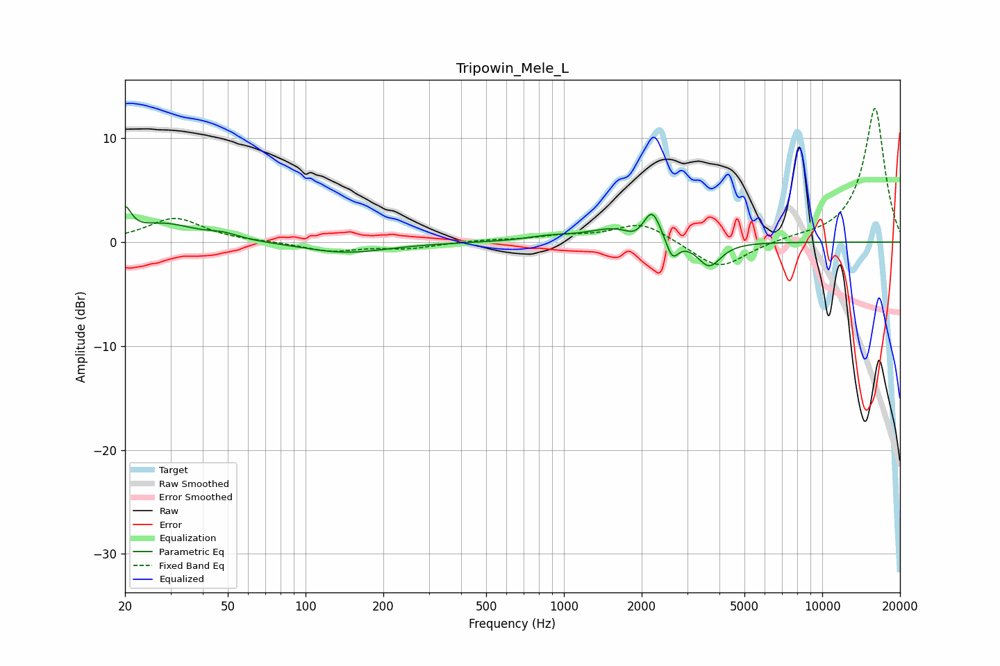

# Tripowin_Mele_L
See [usage instructions](https://github.com/jaakkopasanen/AutoEq#usage) for more options and info.

### Parametric EQs
Apply preamp of -3.5 dB when using parametric equalizer.

|   # | Type    |   Fc (Hz) |    Q |   Gain (dB) |
|-----|---------|-----------|------|-------------|
|   1 | Peaking |        20 | 6    |         2.4 |
|   2 | Peaking |        28 | 1.18 |         1.7 |
|   3 | Peaking |        48 | 2.28 |         0.5 |
|   4 | Peaking |       143 | 0.88 |        -1   |
|   5 | Peaking |       877 | 1.59 |         0.4 |
|   6 | Peaking |      1588 | 1.33 |         1.3 |
|   7 | Peaking |      1882 | 3.87 |        -0.7 |
|   8 | Peaking |      2196 | 4.35 |         2.7 |
|   9 | Peaking |      2628 | 6    |        -2   |
|  10 | Peaking |      3650 | 3.1  |        -2.4 |

### Fixed Band EQs
When using fixed band (also called graphic) equalizer, apply preamp of **-13.0 dB** (if available) and set gains manually with these parameters.

|   # | Type    |   Fc (Hz) |    Q |   Gain (dB) |
|-----|---------|-----------|------|-------------|
|   1 | Peaking |        31 | 1.41 |         2.3 |
|   2 | Peaking |        62 | 1.41 |         0   |
|   3 | Peaking |       125 | 1.41 |        -0.9 |
|   4 | Peaking |       250 | 1.41 |        -0.6 |
|   5 | Peaking |       500 | 1.41 |         0.2 |
|   6 | Peaking |      1000 | 1.41 |         0.5 |
|   7 | Peaking |      2000 | 1.41 |         1.9 |
|   8 | Peaking |      4000 | 1.41 |        -2.7 |
|   9 | Peaking |      8000 | 1.41 |         0.3 |
|  10 | Peaking |     16000 | 1.41 |        13   |

### Graphs

