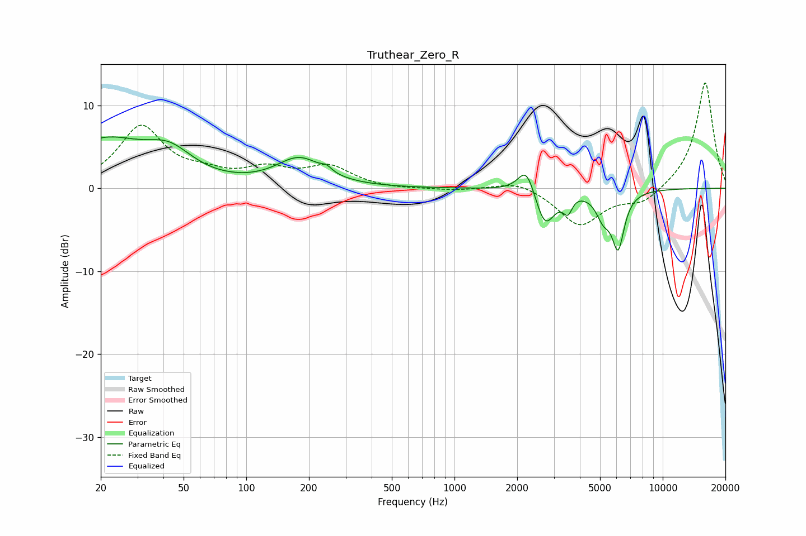

# Truthear_Zero_R
See [usage instructions](https://github.com/jaakkopasanen/AutoEq#usage) for more options and info.

### Parametric EQs
Apply preamp of -6.3 dB when using parametric equalizer.

|   # | Type    |   Fc (Hz) |    Q |   Gain (dB) |
|-----|---------|-----------|------|-------------|
|   1 | Peaking |        21 | 0.71 |         5.5 |
|   2 | Peaking |        43 | 1.26 |         3   |
|   3 | Peaking |       180 | 1.28 |         3.4 |
|   4 | Peaking |       243 | 6    |         0.6 |
|   5 | Peaking |      2219 | 3.5  |         3.4 |
|   6 | Peaking |      2718 | 3    |        -4.7 |
|   7 | Peaking |      3519 | 5.72 |        -3.1 |
|   8 | Peaking |      3582 | 4.47 |         1.3 |
|   9 | Peaking |      5183 | 4.01 |        -2.6 |
|  10 | Peaking |      6106 | 4.64 |        -6.5 |

### Fixed Band EQs
When using fixed band (also called graphic) equalizer, apply preamp of **-12.8 dB** (if available) and set gains manually with these parameters.

|   # | Type    |   Fc (Hz) |    Q |   Gain (dB) |
|-----|---------|-----------|------|-------------|
|   1 | Peaking |        31 | 1.41 |         7.3 |
|   2 | Peaking |        62 | 1.41 |         1.2 |
|   3 | Peaking |       125 | 1.41 |         2   |
|   4 | Peaking |       250 | 1.41 |         2.4 |
|   5 | Peaking |       500 | 1.41 |        -0.2 |
|   6 | Peaking |      1000 | 1.41 |        -0.3 |
|   7 | Peaking |      2000 | 1.41 |         1   |
|   8 | Peaking |      4000 | 1.41 |        -4.5 |
|   9 | Peaking |      8000 | 1.41 |        -1.8 |
|  10 | Peaking |     16000 | 1.41 |        12.9 |

### Graphs

