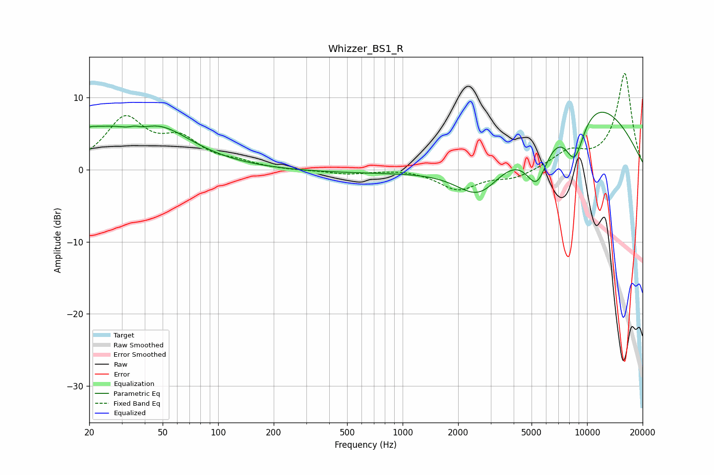

# Whizzer_BS1_R
See [usage instructions](https://github.com/jaakkopasanen/AutoEq#usage) for more options and info.

### Parametric EQs
Apply preamp of -8.1 dB when using parametric equalizer.

|   # | Type    |   Fc (Hz) |    Q |   Gain (dB) |
|-----|---------|-----------|------|-------------|
|   1 | Peaking |        20 | 4.49 |         0.5 |
|   2 | Peaking |        21 | 0.76 |         3.2 |
|   3 | Peaking |        35 | 5.88 |         0.4 |
|   4 | Peaking |        36 | 1.54 |        -1.9 |
|   5 | Peaking |        43 | 0.71 |         6.2 |
|   6 | Peaking |      1418 | 0.18 |        -0.6 |
|   7 | Peaking |      2608 | 1.11 |        -5.3 |
|   8 | Peaking |      5344 | 2.12 |        -6.8 |
|   9 | Peaking |      8563 | 2.27 |        -7   |
|  10 | Peaking |      9406 | 0.38 |        10.6 |

### Fixed Band EQs
When using fixed band (also called graphic) equalizer, apply preamp of **-13.4 dB** (if available) and set gains manually with these parameters.

|   # | Type    |   Fc (Hz) |    Q |   Gain (dB) |
|-----|---------|-----------|------|-------------|
|   1 | Peaking |        31 | 1.41 |         6.8 |
|   2 | Peaking |        62 | 1.41 |         3.6 |
|   3 | Peaking |       125 | 1.41 |         0.8 |
|   4 | Peaking |       250 | 1.41 |        -0.1 |
|   5 | Peaking |       500 | 1.41 |        -0.6 |
|   6 | Peaking |      1000 | 1.41 |         0.2 |
|   7 | Peaking |      2000 | 1.41 |        -2.7 |
|   8 | Peaking |      4000 | 1.41 |        -1.2 |
|   9 | Peaking |      8000 | 1.41 |         2.3 |
|  10 | Peaking |     16000 | 1.41 |        13.4 |

### Graphs

