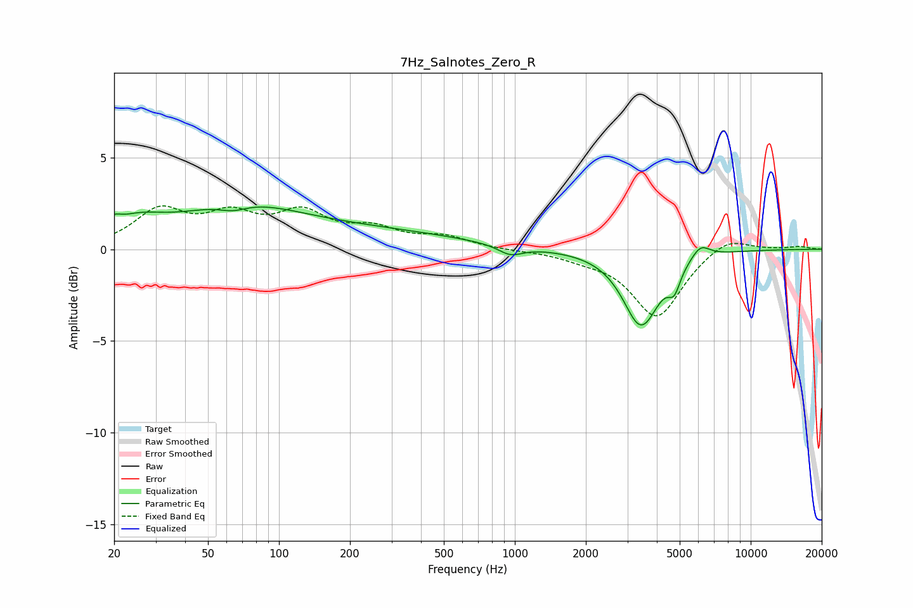

# 7Hz_Salnotes_Zero_R
See [usage instructions](https://github.com/jaakkopasanen/AutoEq#usage) for more options and info.

### Parametric EQs
Apply preamp of -2.4 dB when using parametric equalizer.

|   # | Type    |   Fc (Hz) |    Q |   Gain (dB) |
|-----|---------|-----------|------|-------------|
|   1 | Peaking |        20 | 5.54 |         0.4 |
|   2 | Peaking |        24 | 1.14 |         1.1 |
|   3 | Peaking |        64 | 2.35 |        -0.4 |
|   4 | Peaking |        67 | 0.55 |         2   |
|   5 | Peaking |       247 | 0.37 |         0.9 |
|   6 | Peaking |       958 | 2.71 |        -0.5 |
|   7 | Peaking |      3040 | 2.11 |         0.2 |
|   8 | Peaking |      3415 | 1.82 |        -4.3 |
|   9 | Peaking |      4741 | 5.41 |        -1.1 |
|  10 | Peaking |      6120 | 3.48 |         0.8 |

### Fixed Band EQs
When using fixed band (also called graphic) equalizer, apply preamp of **-2.5 dB** (if available) and set gains manually with these parameters.

|   # | Type    |   Fc (Hz) |    Q |   Gain (dB) |
|-----|---------|-----------|------|-------------|
|   1 | Peaking |        31 | 1.41 |         2   |
|   2 | Peaking |        62 | 1.41 |         1.6 |
|   3 | Peaking |       125 | 1.41 |         1.8 |
|   4 | Peaking |       250 | 1.41 |         0.9 |
|   5 | Peaking |       500 | 1.41 |         0.6 |
|   6 | Peaking |      1000 | 1.41 |        -0   |
|   7 | Peaking |      2000 | 1.41 |        -0.4 |
|   8 | Peaking |      4000 | 1.41 |        -3.7 |
|   9 | Peaking |      8000 | 1.41 |         0.8 |
|  10 | Peaking |     16000 | 1.41 |         0.2 |

### Graphs

