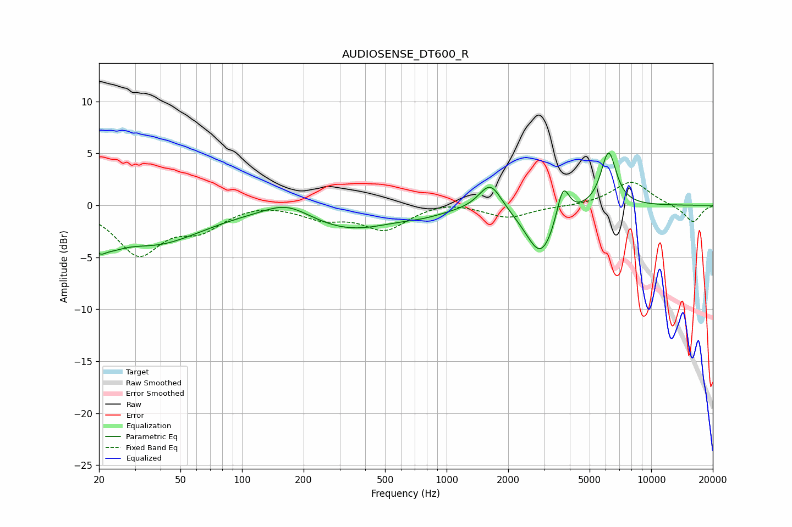

# AUDIOSENSE_DT600_R
See [usage instructions](https://github.com/jaakkopasanen/AutoEq#usage) for more options and info.

### Parametric EQs
Apply preamp of -5.1 dB when using parametric equalizer.

|   # | Type    |   Fc (Hz) |    Q |   Gain (dB) |
|-----|---------|-----------|------|-------------|
|   1 | Peaking |        20 | 4.82 |        -1.5 |
|   2 | Peaking |        23 | 2.08 |        -1.4 |
|   3 | Peaking |        38 | 0.62 |        -3.5 |
|   4 | Peaking |       166 | 1.25 |         1.4 |
|   5 | Peaking |       334 | 0.64 |        -2.3 |
|   6 | Peaking |       773 | 1.36 |        -0.4 |
|   7 | Peaking |      1635 | 2.56 |         2.7 |
|   8 | Peaking |      2895 | 1.91 |        -5   |
|   9 | Peaking |      3704 | 4.57 |         3.5 |
|  10 | Peaking |      6188 | 3.66 |         5.3 |

### Fixed Band EQs
When using fixed band (also called graphic) equalizer, apply preamp of **-2.3 dB** (if available) and set gains manually with these parameters.

|   # | Type    |   Fc (Hz) |    Q |   Gain (dB) |
|-----|---------|-----------|------|-------------|
|   1 | Peaking |        31 | 1.41 |        -4.6 |
|   2 | Peaking |        62 | 1.41 |        -2   |
|   3 | Peaking |       125 | 1.41 |         0.3 |
|   4 | Peaking |       250 | 1.41 |        -1.1 |
|   5 | Peaking |       500 | 1.41 |        -2.3 |
|   6 | Peaking |      1000 | 1.41 |         0.5 |
|   7 | Peaking |      2000 | 1.41 |        -1.2 |
|   8 | Peaking |      4000 | 1.41 |        -0.1 |
|   9 | Peaking |      8000 | 1.41 |         2.3 |
|  10 | Peaking |     16000 | 1.41 |        -1.7 |

### Graphs

