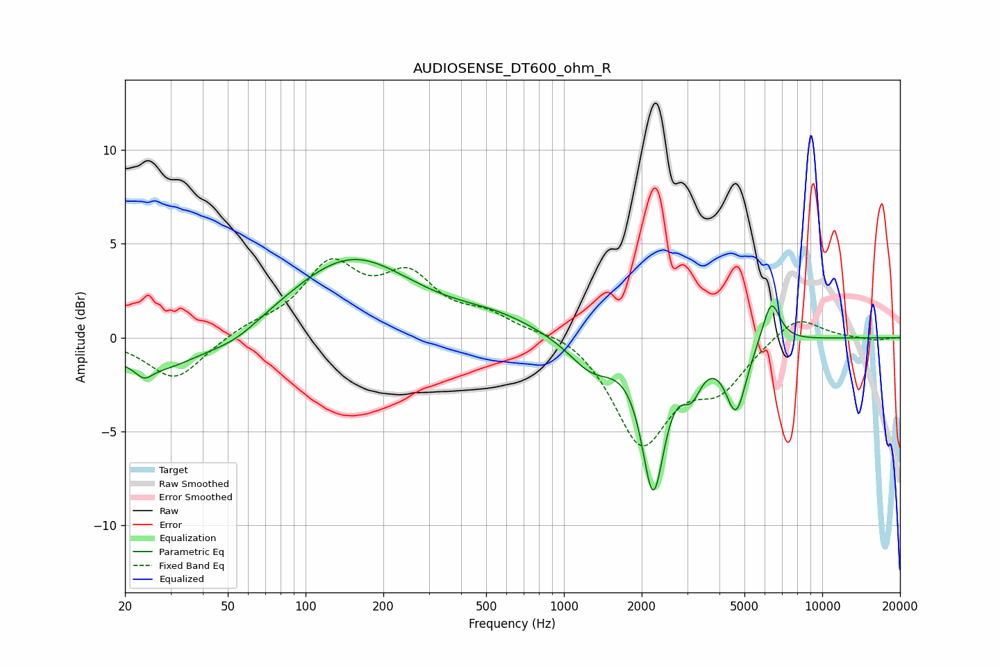

# AUDIOSENSE_DT600_ohm_R
See [usage instructions](https://github.com/jaakkopasanen/AutoEq#usage) for more options and info.

### Parametric EQs
Apply preamp of -4.3 dB when using parametric equalizer.

|   # | Type    |   Fc (Hz) |    Q |   Gain (dB) |
|-----|---------|-----------|------|-------------|
|   1 | Peaking |        24 | 4.67 |        -0.6 |
|   2 | Peaking |        27 | 0.78 |        -1.9 |
|   3 | Peaking |        53 | 1.44 |        -0.6 |
|   4 | Peaking |       150 | 0.6  |         4.2 |
|   5 | Peaking |       544 | 0.83 |         0.8 |
|   6 | Peaking |      1283 | 1.58 |        -1.7 |
|   7 | Peaking |      2216 | 3.24 |        -7.6 |
|   8 | Peaking |      3119 | 3.64 |        -1.8 |
|   9 | Peaking |      4639 | 3.47 |        -3.6 |
|  10 | Peaking |      6345 | 3.98 |         2.4 |

### Fixed Band EQs
When using fixed band (also called graphic) equalizer, apply preamp of **-4.3 dB** (if available) and set gains manually with these parameters.

|   # | Type    |   Fc (Hz) |    Q |   Gain (dB) |
|-----|---------|-----------|------|-------------|
|   1 | Peaking |        31 | 1.41 |        -2.3 |
|   2 | Peaking |        62 | 1.41 |         0.5 |
|   3 | Peaking |       125 | 1.41 |         3.6 |
|   4 | Peaking |       250 | 1.41 |         2.9 |
|   5 | Peaking |       500 | 1.41 |         1   |
|   6 | Peaking |      1000 | 1.41 |         0.5 |
|   7 | Peaking |      2000 | 1.41 |        -5.5 |
|   8 | Peaking |      4000 | 1.41 |        -2.3 |
|   9 | Peaking |      8000 | 1.41 |         1.3 |
|  10 | Peaking |     16000 | 1.41 |        -0.2 |

### Graphs

