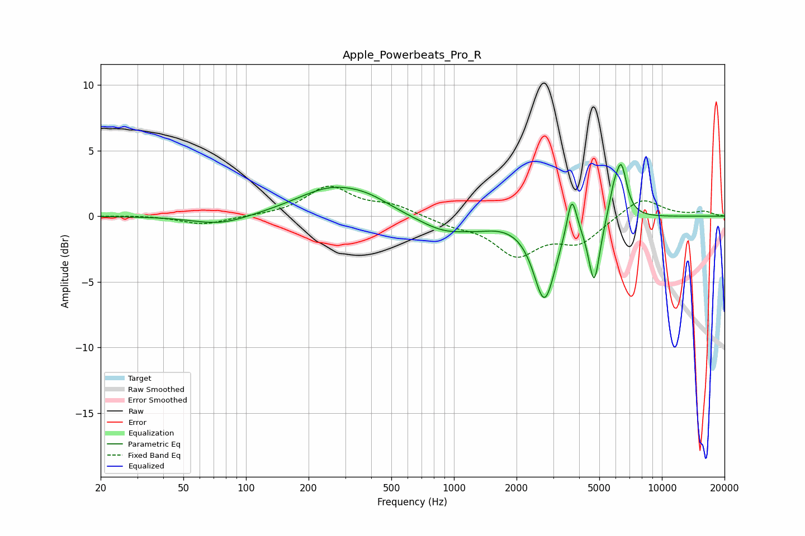

# Apple_Powerbeats_Pro_R
See [usage instructions](https://github.com/jaakkopasanen/AutoEq#usage) for more options and info.

### Parametric EQs
Apply preamp of -4.0 dB when using parametric equalizer.

|   # | Type    |   Fc (Hz) |    Q |   Gain (dB) |
|-----|---------|-----------|------|-------------|
|   1 | Peaking |        76 | 1.04 |        -0.7 |
|   2 | Peaking |       263 | 0.8  |         2.2 |
|   3 | Peaking |       394 | 1.44 |         0.5 |
|   4 | Peaking |       910 | 1.08 |        -1.2 |
|   5 | Peaking |      1338 | 2.05 |        -0.3 |
|   6 | Peaking |      2727 | 2.67 |        -6.2 |
|   7 | Peaking |      3687 | 6    |         3.1 |
|   8 | Peaking |      4725 | 5.16 |        -4.9 |
|   9 | Peaking |      5841 | 5.99 |         1.4 |
|  10 | Peaking |      6374 | 4.93 |         3.9 |

### Fixed Band EQs
When using fixed band (also called graphic) equalizer, apply preamp of **-2.4 dB** (if available) and set gains manually with these parameters.

|   # | Type    |   Fc (Hz) |    Q |   Gain (dB) |
|-----|---------|-----------|------|-------------|
|   1 | Peaking |        31 | 1.41 |         0.1 |
|   2 | Peaking |        62 | 1.41 |        -0.7 |
|   3 | Peaking |       125 | 1.41 |         0   |
|   4 | Peaking |       250 | 1.41 |         2.2 |
|   5 | Peaking |       500 | 1.41 |         0.8 |
|   6 | Peaking |      1000 | 1.41 |        -0.5 |
|   7 | Peaking |      2000 | 1.41 |        -2.8 |
|   8 | Peaking |      4000 | 1.41 |        -1.9 |
|   9 | Peaking |      8000 | 1.41 |         1.5 |
|  10 | Peaking |     16000 | 1.41 |         0.3 |

### Graphs

