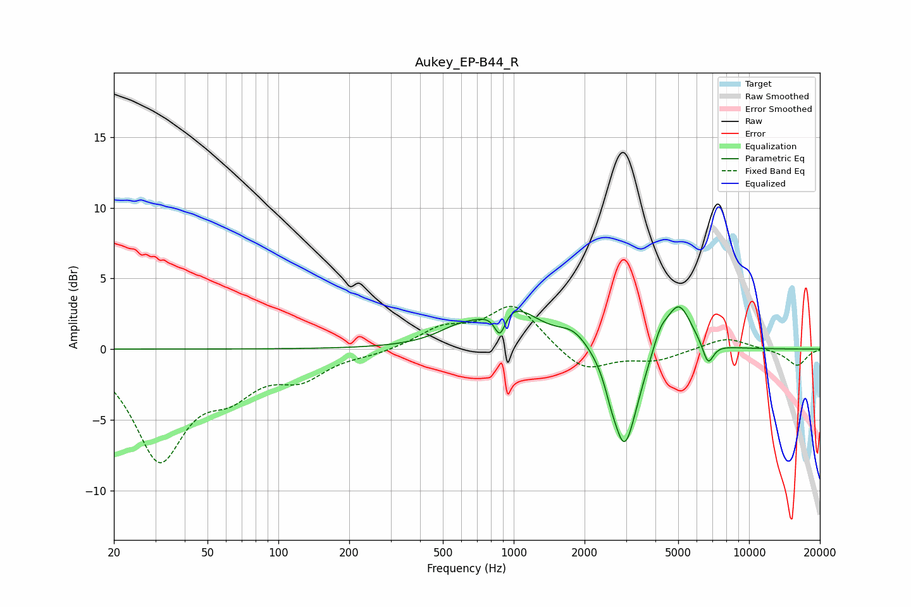

# Aukey_EP-B44_R
See [usage instructions](https://github.com/jaakkopasanen/AutoEq#usage) for more options and info.

### Parametric EQs
Apply preamp of -3.1 dB when using parametric equalizer.

|   # | Type    |   Fc (Hz) |    Q |   Gain (dB) |
|-----|---------|-----------|------|-------------|
|   1 | Peaking |       582 | 1.5  |         0.9 |
|   2 | Peaking |       874 | 6    |        -1.8 |
|   3 | Peaking |       979 | 1.23 |         2.8 |
|   4 | Peaking |      1796 | 2.15 |         1.1 |
|   5 | Peaking |      2580 | 5.55 |        -0.8 |
|   6 | Peaking |      2942 | 2.93 |        -6.3 |
|   7 | Peaking |      3277 | 2.55 |        -1.1 |
|   8 | Peaking |      4200 | 4.38 |         1.2 |
|   9 | Peaking |      5024 | 2.51 |         3.4 |
|  10 | Peaking |      6696 | 5.84 |        -1.6 |

### Fixed Band EQs
When using fixed band (also called graphic) equalizer, apply preamp of **-3.1 dB** (if available) and set gains manually with these parameters.

|   # | Type    |   Fc (Hz) |    Q |   Gain (dB) |
|-----|---------|-----------|------|-------------|
|   1 | Peaking |        31 | 1.41 |        -7.5 |
|   2 | Peaking |        62 | 1.41 |        -2.3 |
|   3 | Peaking |       125 | 1.41 |        -1.8 |
|   4 | Peaking |       250 | 1.41 |        -0.3 |
|   5 | Peaking |       500 | 1.41 |         1.4 |
|   6 | Peaking |      1000 | 1.41 |         3.1 |
|   7 | Peaking |      2000 | 1.41 |        -1.7 |
|   8 | Peaking |      4000 | 1.41 |        -0.8 |
|   9 | Peaking |      8000 | 1.41 |         0.9 |
|  10 | Peaking |     16000 | 1.41 |        -1.2 |

### Graphs

