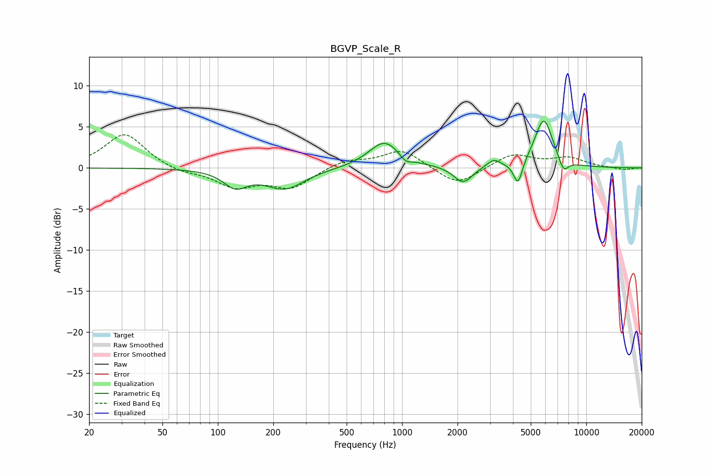

# BGVP_Scale_R
See [usage instructions](https://github.com/jaakkopasanen/AutoEq#usage) for more options and info.

### Parametric EQs
Apply preamp of -5.8 dB when using parametric equalizer.

|   # | Type    |   Fc (Hz) |    Q |   Gain (dB) |
|-----|---------|-----------|------|-------------|
|   1 | Peaking |       124 | 2.2  |        -2   |
|   2 | Peaking |       231 | 1.33 |        -2.5 |
|   3 | Peaking |       804 | 1.67 |         3.3 |
|   4 | Peaking |      1046 | 4.42 |        -0.8 |
|   5 | Peaking |      2147 | 2.7  |        -2.3 |
|   6 | Peaking |      2225 | 1.49 |         0.3 |
|   7 | Peaking |      3145 | 4.01 |         0.9 |
|   8 | Peaking |      4260 | 5.91 |        -2.9 |
|   9 | Peaking |      5880 | 2.75 |         6   |
|  10 | Peaking |      7520 | 4.94 |        -1.7 |

### Fixed Band EQs
When using fixed band (also called graphic) equalizer, apply preamp of **-4.1 dB** (if available) and set gains manually with these parameters.

|   # | Type    |   Fc (Hz) |    Q |   Gain (dB) |
|-----|---------|-----------|------|-------------|
|   1 | Peaking |        31 | 1.41 |         4.2 |
|   2 | Peaking |        62 | 1.41 |        -0.6 |
|   3 | Peaking |       125 | 1.41 |        -2.2 |
|   4 | Peaking |       250 | 1.41 |        -2.3 |
|   5 | Peaking |       500 | 1.41 |         1   |
|   6 | Peaking |      1000 | 1.41 |         2.2 |
|   7 | Peaking |      2000 | 1.41 |        -2.2 |
|   8 | Peaking |      4000 | 1.41 |         1.7 |
|   9 | Peaking |      8000 | 1.41 |         1.1 |
|  10 | Peaking |     16000 | 1.41 |        -0.3 |

### Graphs

