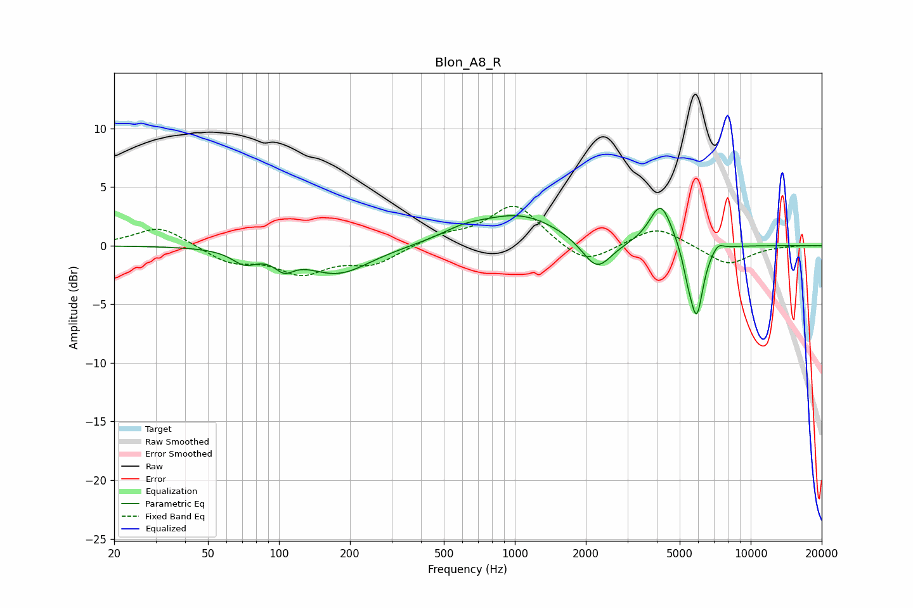

# Blon_A8_R
See [usage instructions](https://github.com/jaakkopasanen/AutoEq#usage) for more options and info.

### Parametric EQs
Apply preamp of -3.3 dB when using parametric equalizer.

|   # | Type    |   Fc (Hz) |    Q |   Gain (dB) |
|-----|---------|-----------|------|-------------|
|   1 | Peaking |        71 | 2.67 |        -1.1 |
|   2 | Peaking |       105 | 3.57 |        -1.1 |
|   3 | Peaking |       178 | 1.02 |        -2.4 |
|   4 | Peaking |       603 | 1.49 |         0.7 |
|   5 | Peaking |      1049 | 0.8  |         2.6 |
|   6 | Peaking |      2228 | 2.24 |        -2.7 |
|   7 | Peaking |      4157 | 2.91 |         3.7 |
|   8 | Peaking |      5422 | 5.99 |        -1.6 |
|   9 | Peaking |      5904 | 4.99 |        -5.9 |
|  10 | Peaking |      7271 | 5.75 |         0.6 |

### Fixed Band EQs
When using fixed band (also called graphic) equalizer, apply preamp of **-3.5 dB** (if available) and set gains manually with these parameters.

|   # | Type    |   Fc (Hz) |    Q |   Gain (dB) |
|-----|---------|-----------|------|-------------|
|   1 | Peaking |        31 | 1.41 |         1.7 |
|   2 | Peaking |        62 | 1.41 |        -1.4 |
|   3 | Peaking |       125 | 1.41 |        -2.2 |
|   4 | Peaking |       250 | 1.41 |        -1.5 |
|   5 | Peaking |       500 | 1.41 |         0.8 |
|   6 | Peaking |      1000 | 1.41 |         3.5 |
|   7 | Peaking |      2000 | 1.41 |        -1.8 |
|   8 | Peaking |      4000 | 1.41 |         1.7 |
|   9 | Peaking |      8000 | 1.41 |        -1.7 |
|  10 | Peaking |     16000 | 1.41 |         0   |

### Graphs

