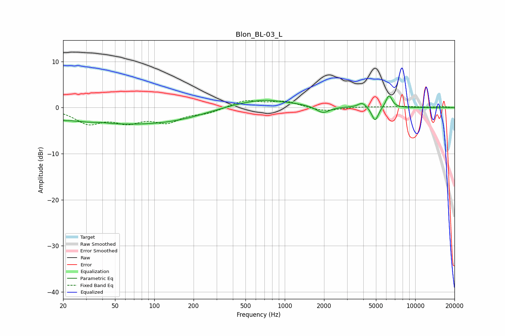

# Blon_BL-03_L
See [usage instructions](https://github.com/jaakkopasanen/AutoEq#usage) for more options and info.

### Parametric EQs
Apply preamp of -2.6 dB when using parametric equalizer.

|   # | Type    |   Fc (Hz) |    Q |   Gain (dB) |
|-----|---------|-----------|------|-------------|
|   1 | Peaking |        21 | 6    |        -0.2 |
|   2 | Peaking |        40 | 2.69 |         0.2 |
|   3 | Peaking |        45 | 0.3  |        -3.2 |
|   4 | Peaking |       164 | 0.52 |        -1.3 |
|   5 | Peaking |       615 | 0.51 |         1.8 |
|   6 | Peaking |       701 | 1.68 |         0.3 |
|   7 | Peaking |      1958 | 2.79 |        -1.6 |
|   8 | Peaking |      3928 | 4.48 |         1.1 |
|   9 | Peaking |      4924 | 5.44 |        -3.1 |
|  10 | Peaking |      6296 | 5.76 |         2.8 |

### Fixed Band EQs
When using fixed band (also called graphic) equalizer, apply preamp of **-1.6 dB** (if available) and set gains manually with these parameters.

|   # | Type    |   Fc (Hz) |    Q |   Gain (dB) |
|-----|---------|-----------|------|-------------|
|   1 | Peaking |        31 | 1.41 |        -3.2 |
|   2 | Peaking |        62 | 1.41 |        -2.6 |
|   3 | Peaking |       125 | 1.41 |        -2.8 |
|   4 | Peaking |       250 | 1.41 |        -1   |
|   5 | Peaking |       500 | 1.41 |         1.6 |
|   6 | Peaking |      1000 | 1.41 |         1.3 |
|   7 | Peaking |      2000 | 1.41 |        -0.9 |
|   8 | Peaking |      4000 | 1.41 |         0.2 |
|   9 | Peaking |      8000 | 1.41 |         0.3 |
|  10 | Peaking |     16000 | 1.41 |         0.2 |

### Graphs

