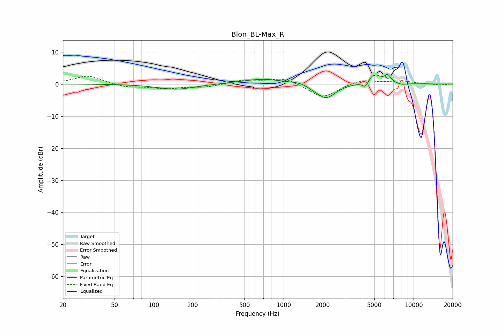

# Blon_BL-Max_R
See [usage instructions](https://github.com/jaakkopasanen/AutoEq#usage) for more options and info.

### Parametric EQs
Apply preamp of -3.1 dB when using parametric equalizer.

|   # | Type    |   Fc (Hz) |    Q |   Gain (dB) |
|-----|---------|-----------|------|-------------|
|   1 | Peaking |       148 | 1.01 |        -1.7 |
|   2 | Peaking |       692 | 0.89 |         1.6 |
|   3 | Peaking |      1325 | 2.3  |         0.6 |
|   4 | Peaking |      1674 | 4.43 |        -0.4 |
|   5 | Peaking |      2112 | 2.01 |        -4   |
|   6 | Peaking |      2151 | 1.79 |        -0.5 |
|   7 | Peaking |      4266 | 5.72 |        -2.3 |
|   8 | Peaking |      4938 | 2.57 |         3.3 |
|   9 | Peaking |      6330 | 6    |         2.1 |
|  10 | Peaking |      8139 | 4.03 |        -0.4 |

### Fixed Band EQs
When using fixed band (also called graphic) equalizer, apply preamp of **-2.5 dB** (if available) and set gains manually with these parameters.

|   # | Type    |   Fc (Hz) |    Q |   Gain (dB) |
|-----|---------|-----------|------|-------------|
|   1 | Peaking |        31 | 1.41 |         2.6 |
|   2 | Peaking |        62 | 1.41 |        -1   |
|   3 | Peaking |       125 | 1.41 |        -1.3 |
|   4 | Peaking |       250 | 1.41 |        -0.9 |
|   5 | Peaking |       500 | 1.41 |         1.2 |
|   6 | Peaking |      1000 | 1.41 |         2   |
|   7 | Peaking |      2000 | 1.41 |        -4.4 |
|   8 | Peaking |      4000 | 1.41 |         1.5 |
|   9 | Peaking |      8000 | 1.41 |         0.9 |
|  10 | Peaking |     16000 | 1.41 |        -0.4 |

### Graphs

