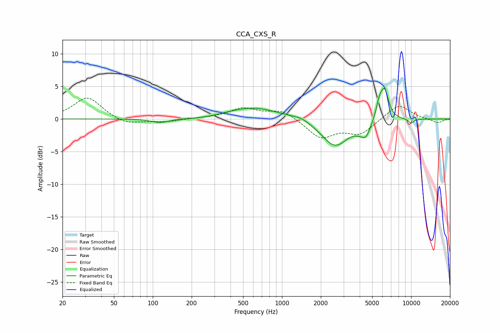

# CCA_CXS_R
See [usage instructions](https://github.com/jaakkopasanen/AutoEq#usage) for more options and info.

### Parametric EQs
Apply preamp of -4.8 dB when using parametric equalizer.

|   # | Type    |   Fc (Hz) |    Q |   Gain (dB) |
|-----|---------|-----------|------|-------------|
|   1 | Peaking |       114 | 2.07 |        -0.6 |
|   2 | Peaking |       255 | 0.92 |        -0.3 |
|   3 | Peaking |       589 | 0.66 |         1.8 |
|   4 | Peaking |      1406 | 2.38 |         0.4 |
|   5 | Peaking |      2574 | 1.35 |        -4.2 |
|   6 | Peaking |      3954 | 3.62 |        -0.5 |
|   7 | Peaking |      4473 | 4.14 |        -2   |
|   8 | Peaking |      5663 | 5.92 |         2   |
|   9 | Peaking |      6222 | 4.25 |         4.5 |
|  10 | Peaking |     10000 | 6    |        -0.7 |

### Fixed Band EQs
When using fixed band (also called graphic) equalizer, apply preamp of **-3.3 dB** (if available) and set gains manually with these parameters.

|   # | Type    |   Fc (Hz) |    Q |   Gain (dB) |
|-----|---------|-----------|------|-------------|
|   1 | Peaking |        31 | 1.41 |         3.4 |
|   2 | Peaking |        62 | 1.41 |        -1   |
|   3 | Peaking |       125 | 1.41 |        -0.4 |
|   4 | Peaking |       250 | 1.41 |         0.1 |
|   5 | Peaking |       500 | 1.41 |         1.6 |
|   6 | Peaking |      1000 | 1.41 |         1.4 |
|   7 | Peaking |      2000 | 1.41 |        -2.8 |
|   8 | Peaking |      4000 | 1.41 |        -2.2 |
|   9 | Peaking |      8000 | 1.41 |         2.3 |
|  10 | Peaking |     16000 | 1.41 |        -0.6 |

### Graphs

