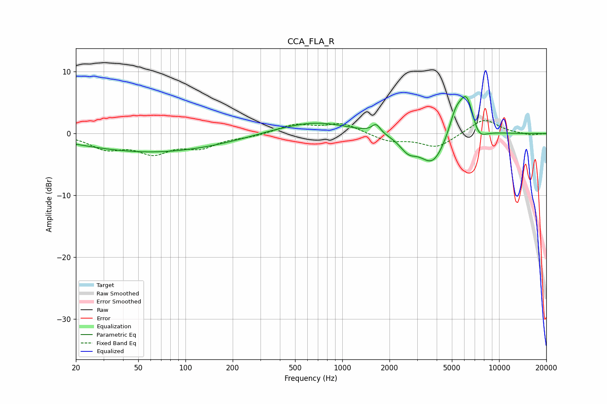

# CCA_FLA_R
See [usage instructions](https://github.com/jaakkopasanen/AutoEq#usage) for more options and info.

### Parametric EQs
Apply preamp of -6.1 dB when using parametric equalizer.

|   # | Type    |   Fc (Hz) |    Q |   Gain (dB) |
|-----|---------|-----------|------|-------------|
|   1 | Peaking |        61 | 0.32 |        -2.7 |
|   2 | Peaking |        73 | 0.21 |        -0.3 |
|   3 | Peaking |       345 | 1.18 |         0.2 |
|   4 | Peaking |       666 | 0.65 |         2   |
|   5 | Peaking |      1643 | 5.3  |         1.4 |
|   6 | Peaking |      2635 | 2.6  |        -2.1 |
|   7 | Peaking |      3780 | 1.68 |        -5.1 |
|   8 | Peaking |      5262 | 3.47 |         2.8 |
|   9 | Peaking |      6230 | 2.44 |         7.6 |
|  10 | Peaking |      7268 | 2.57 |        -3.1 |

### Fixed Band EQs
When using fixed band (also called graphic) equalizer, apply preamp of **-2.2 dB** (if available) and set gains manually with these parameters.

|   # | Type    |   Fc (Hz) |    Q |   Gain (dB) |
|-----|---------|-----------|------|-------------|
|   1 | Peaking |        31 | 1.41 |        -2.2 |
|   2 | Peaking |        62 | 1.41 |        -2.8 |
|   3 | Peaking |       125 | 1.41 |        -2   |
|   4 | Peaking |       250 | 1.41 |        -0.4 |
|   5 | Peaking |       500 | 1.41 |         1.4 |
|   6 | Peaking |      1000 | 1.41 |         1.6 |
|   7 | Peaking |      2000 | 1.41 |        -1.2 |
|   8 | Peaking |      4000 | 1.41 |        -2.2 |
|   9 | Peaking |      8000 | 1.41 |         2.5 |
|  10 | Peaking |     16000 | 1.41 |        -0.3 |

### Graphs

