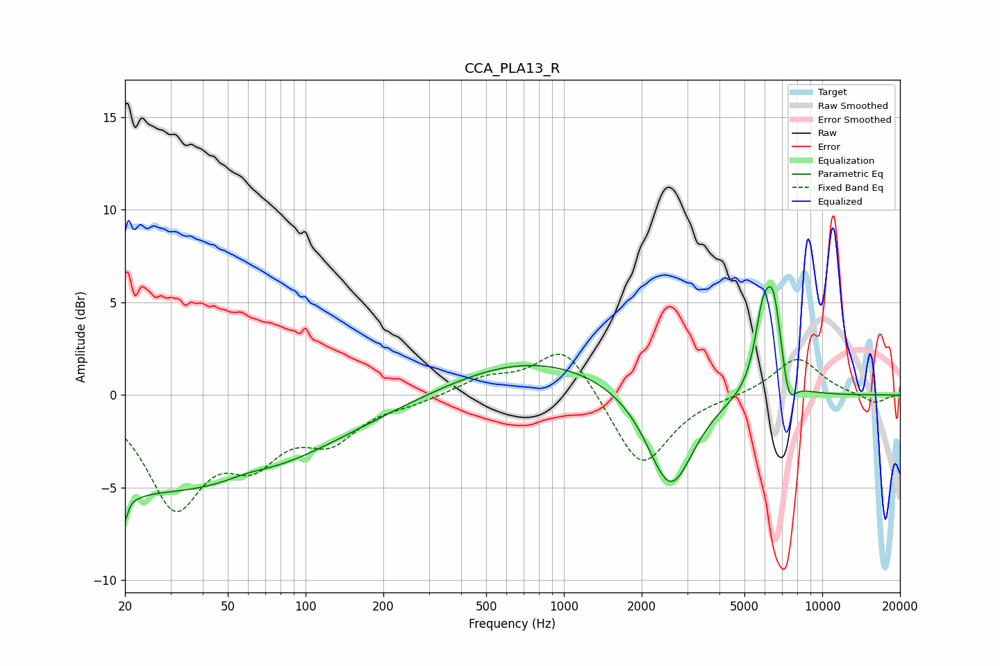

# CCA_PLA13_R
See [usage instructions](https://github.com/jaakkopasanen/AutoEq#usage) for more options and info.

### Parametric EQs
Apply preamp of -6.0 dB when using parametric equalizer.

|   # | Type    |   Fc (Hz) |    Q |   Gain (dB) |
|-----|---------|-----------|------|-------------|
|   1 | Peaking |        20 | 5.54 |        -4.7 |
|   2 | Peaking |        20 | 5.94 |         3.2 |
|   3 | Peaking |        21 | 0.18 |        -4.9 |
|   4 | Peaking |        59 | 1.65 |         0.3 |
|   5 | Peaking |       103 | 0.22 |        -0.7 |
|   6 | Peaking |       733 | 0.43 |         2.1 |
|   7 | Peaking |      2584 | 1.59 |        -5.4 |
|   8 | Peaking |      5865 | 4.49 |         3.1 |
|   9 | Peaking |      6474 | 4    |         4.8 |
|  10 | Peaking |      7401 | 5.06 |        -1.8 |

### Fixed Band EQs
When using fixed band (also called graphic) equalizer, apply preamp of **-2.3 dB** (if available) and set gains manually with these parameters.

|   # | Type    |   Fc (Hz) |    Q |   Gain (dB) |
|-----|---------|-----------|------|-------------|
|   1 | Peaking |        31 | 1.41 |        -5.7 |
|   2 | Peaking |        62 | 1.41 |        -2.8 |
|   3 | Peaking |       125 | 1.41 |        -2.1 |
|   4 | Peaking |       250 | 1.41 |        -0.3 |
|   5 | Peaking |       500 | 1.41 |         0.9 |
|   6 | Peaking |      1000 | 1.41 |         2.8 |
|   7 | Peaking |      2000 | 1.41 |        -4.1 |
|   8 | Peaking |      4000 | 1.41 |        -0.1 |
|   9 | Peaking |      8000 | 1.41 |         2   |
|  10 | Peaking |     16000 | 1.41 |        -0.5 |

### Graphs

