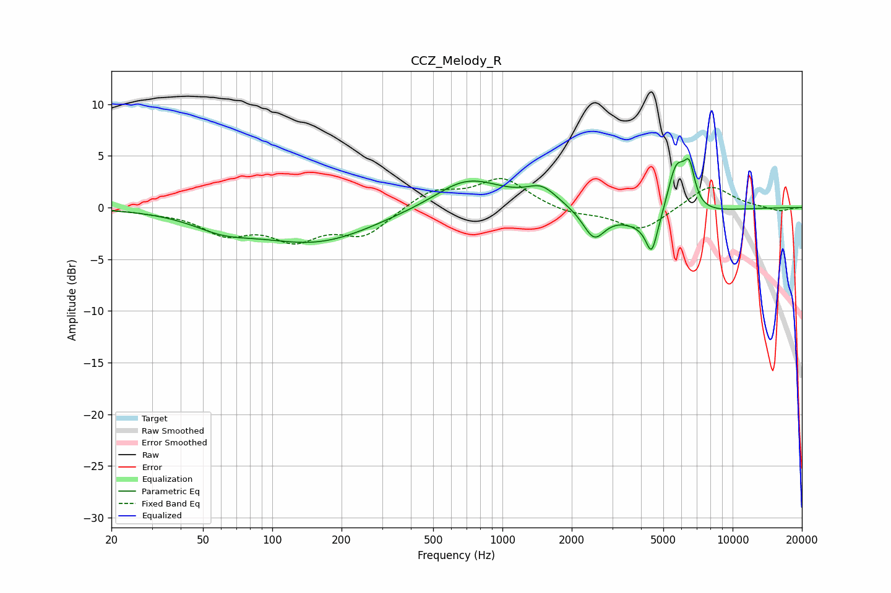

# CCZ_Melody_R
See [usage instructions](https://github.com/jaakkopasanen/AutoEq#usage) for more options and info.

### Parametric EQs
Apply preamp of -4.8 dB when using parametric equalizer.

|   # | Type    |   Fc (Hz) |    Q |   Gain (dB) |
|-----|---------|-----------|------|-------------|
|   1 | Peaking |        61 | 1.06 |        -1.3 |
|   2 | Peaking |       155 | 0.55 |        -3.3 |
|   3 | Peaking |       501 | 1.14 |        -0.3 |
|   4 | Peaking |       692 | 0.89 |         3.2 |
|   5 | Peaking |      1482 | 2.13 |         1.6 |
|   6 | Peaking |      2499 | 2.97 |        -2.8 |
|   7 | Peaking |      4449 | 6    |        -2.9 |
|   8 | Peaking |      4976 | 1.19 |        -3.4 |
|   9 | Peaking |      5679 | 2.9  |         6.6 |
|  10 | Peaking |      6493 | 5.82 |         3.3 |

### Fixed Band EQs
When using fixed band (also called graphic) equalizer, apply preamp of **-2.9 dB** (if available) and set gains manually with these parameters.

|   # | Type    |   Fc (Hz) |    Q |   Gain (dB) |
|-----|---------|-----------|------|-------------|
|   1 | Peaking |        31 | 1.41 |        -0.3 |
|   2 | Peaking |        62 | 1.41 |        -2.3 |
|   3 | Peaking |       125 | 1.41 |        -2.7 |
|   4 | Peaking |       250 | 1.41 |        -2.5 |
|   5 | Peaking |       500 | 1.41 |         1.7 |
|   6 | Peaking |      1000 | 1.41 |         2.8 |
|   7 | Peaking |      2000 | 1.41 |        -0.6 |
|   8 | Peaking |      4000 | 1.41 |        -2.3 |
|   9 | Peaking |      8000 | 1.41 |         2.3 |
|  10 | Peaking |     16000 | 1.41 |        -0.4 |

### Graphs

