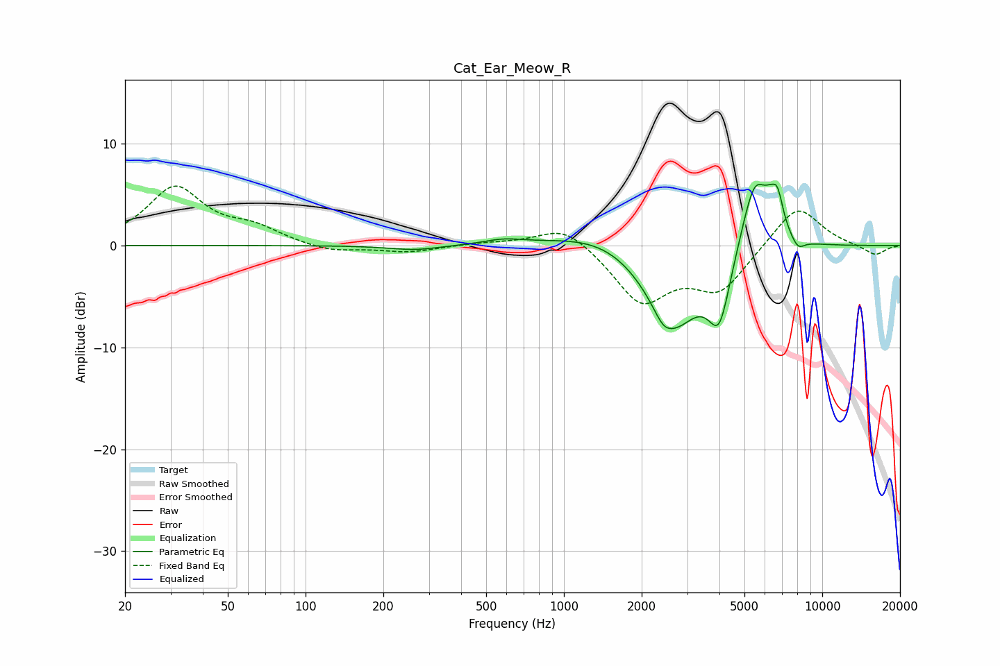

# Cat_Ear_Meow_R
See [usage instructions](https://github.com/jaakkopasanen/AutoEq#usage) for more options and info.

### Parametric EQs
Apply preamp of -6.1 dB when using parametric equalizer.

|   # | Type    |   Fc (Hz) |    Q |   Gain (dB) |
|-----|---------|-----------|------|-------------|
|   1 | Peaking |       264 | 1.43 |        -0.5 |
|   2 | Peaking |       583 | 1.93 |         0.5 |
|   3 | Peaking |      1461 | 0.73 |         1.9 |
|   4 | Peaking |      2423 | 4.32 |        -1   |
|   5 | Peaking |      2650 | 1.23 |        -8.3 |
|   6 | Peaking |      3998 | 3.24 |        -6.3 |
|   7 | Peaking |      5483 | 2.46 |         7.7 |
|   8 | Peaking |      6258 | 5.99 |         1.1 |
|   9 | Peaking |      6710 | 5.99 |         3.2 |
|  10 | Peaking |      8049 | 5.12 |        -1.1 |

### Fixed Band EQs
When using fixed band (also called graphic) equalizer, apply preamp of **-5.9 dB** (if available) and set gains manually with these parameters.

|   # | Type    |   Fc (Hz) |    Q |   Gain (dB) |
|-----|---------|-----------|------|-------------|
|   1 | Peaking |        31 | 1.41 |         5.6 |
|   2 | Peaking |        62 | 1.41 |         1.5 |
|   3 | Peaking |       125 | 1.41 |        -0.7 |
|   4 | Peaking |       250 | 1.41 |        -0.6 |
|   5 | Peaking |       500 | 1.41 |         0.2 |
|   6 | Peaking |      1000 | 1.41 |         2.2 |
|   7 | Peaking |      2000 | 1.41 |        -5.4 |
|   8 | Peaking |      4000 | 1.41 |        -4.2 |
|   9 | Peaking |      8000 | 1.41 |         4.2 |
|  10 | Peaking |     16000 | 1.41 |        -1   |

### Graphs

