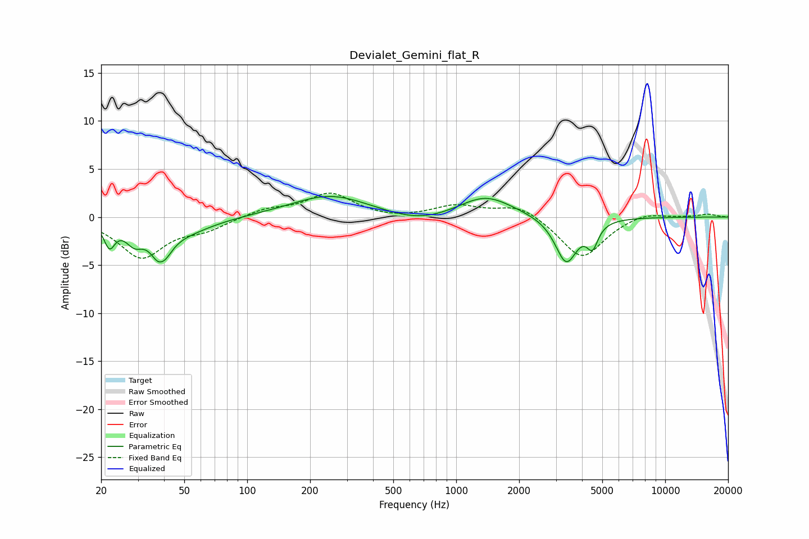

# Devialet_Gemini_flat_R
See [usage instructions](https://github.com/jaakkopasanen/AutoEq#usage) for more options and info.

### Parametric EQs
Apply preamp of -2.2 dB when using parametric equalizer.

|   # | Type    |   Fc (Hz) |    Q |   Gain (dB) |
|-----|---------|-----------|------|-------------|
|   1 | Peaking |        22 | 5.54 |        -2.4 |
|   2 | Peaking |        29 | 3.38 |        -1.8 |
|   3 | Peaking |        39 | 3.68 |        -4.8 |
|   4 | Peaking |        39 | 5.45 |         1.6 |
|   5 | Peaking |        49 | 1.03 |        -1.5 |
|   6 | Peaking |       251 | 0.76 |         2.3 |
|   7 | Peaking |       671 | 0.9  |        -1   |
|   8 | Peaking |      1380 | 1.1  |         2.3 |
|   9 | Peaking |      3361 | 2.66 |        -4.8 |
|  10 | Peaking |      4489 | 5.27 |        -2.3 |

### Fixed Band EQs
When using fixed band (also called graphic) equalizer, apply preamp of **-2.6 dB** (if available) and set gains manually with these parameters.

|   # | Type    |   Fc (Hz) |    Q |   Gain (dB) |
|-----|---------|-----------|------|-------------|
|   1 | Peaking |        31 | 1.41 |        -4.1 |
|   2 | Peaking |        62 | 1.41 |        -1.1 |
|   3 | Peaking |       125 | 1.41 |         0.8 |
|   4 | Peaking |       250 | 1.41 |         2.4 |
|   5 | Peaking |       500 | 1.41 |        -0.3 |
|   6 | Peaking |      1000 | 1.41 |         1.2 |
|   7 | Peaking |      2000 | 1.41 |         1.3 |
|   8 | Peaking |      4000 | 1.41 |        -4.4 |
|   9 | Peaking |      8000 | 1.41 |         0.6 |
|  10 | Peaking |     16000 | 1.41 |         0.3 |

### Graphs

