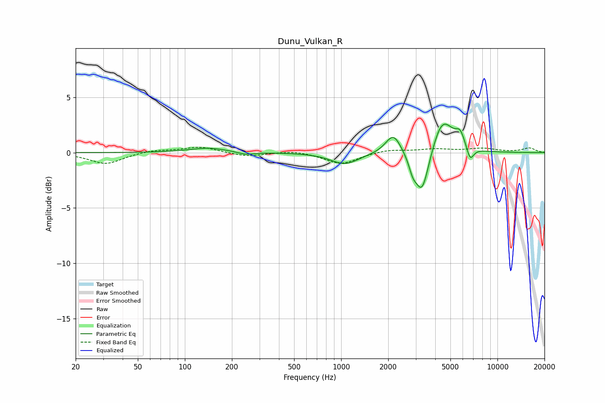

# Dunu_Vulkan_R
See [usage instructions](https://github.com/jaakkopasanen/AutoEq#usage) for more options and info.

### Parametric EQs
Apply preamp of -2.7 dB when using parametric equalizer.

|   # | Type    |   Fc (Hz) |    Q |   Gain (dB) |
|-----|---------|-----------|------|-------------|
|   1 | Peaking |       141 | 1.21 |         0.4 |
|   2 | Peaking |       246 | 2.7  |        -0.3 |
|   3 | Peaking |      1055 | 1.58 |        -1   |
|   4 | Peaking |      2158 | 2.89 |         1.8 |
|   5 | Peaking |      2869 | 5.72 |        -1.1 |
|   6 | Peaking |      3288 | 3.25 |        -3.9 |
|   7 | Peaking |      4393 | 2.41 |         2.6 |
|   8 | Peaking |      4935 | 2.56 |         0.6 |
|   9 | Peaking |      5774 | 4.49 |         1.3 |
|  10 | Peaking |      6692 | 6    |        -1.2 |

### Fixed Band EQs
When using fixed band (also called graphic) equalizer, apply preamp of **-0.6 dB** (if available) and set gains manually with these parameters.

|   # | Type    |   Fc (Hz) |    Q |   Gain (dB) |
|-----|---------|-----------|------|-------------|
|   1 | Peaking |        31 | 1.41 |        -1   |
|   2 | Peaking |        62 | 1.41 |         0.2 |
|   3 | Peaking |       125 | 1.41 |         0.5 |
|   4 | Peaking |       250 | 1.41 |        -0.4 |
|   5 | Peaking |       500 | 1.41 |         0.2 |
|   6 | Peaking |      1000 | 1.41 |        -1   |
|   7 | Peaking |      2000 | 1.41 |         0.3 |
|   8 | Peaking |      4000 | 1.41 |         0.3 |
|   9 | Peaking |      8000 | 1.41 |         0.4 |
|  10 | Peaking |     16000 | 1.41 |         0.4 |

### Graphs

