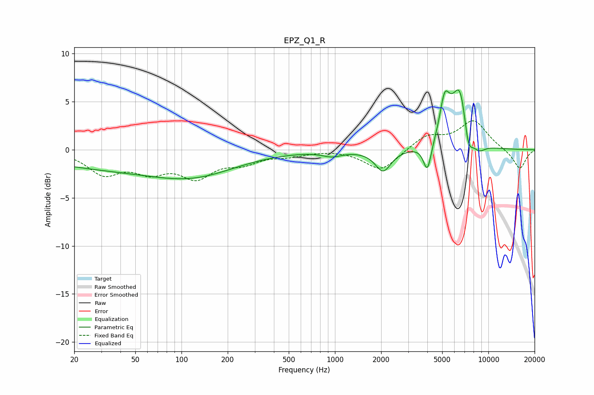

# EPZ_Q1_R
See [usage instructions](https://github.com/jaakkopasanen/AutoEq#usage) for more options and info.

### Parametric EQs
Apply preamp of -6.3 dB when using parametric equalizer.

|   # | Type    |   Fc (Hz) |    Q |   Gain (dB) |
|-----|---------|-----------|------|-------------|
|   1 | Peaking |        48 | 0.23 |        -2   |
|   2 | Peaking |       123 | 0.55 |        -1.3 |
|   3 | Peaking |       956 | 2.28 |        -0.5 |
|   4 | Peaking |      2060 | 2.78 |        -2.2 |
|   5 | Peaking |      4004 | 5.5  |        -2.9 |
|   6 | Peaking |      5167 | 4.56 |         3.6 |
|   7 | Peaking |      5571 | 3.01 |         1.1 |
|   8 | Peaking |      6563 | 2.71 |         6.4 |
|   9 | Peaking |      7371 | 4.38 |        -3.1 |
|  10 | Peaking |      8643 | 3.1  |        -1   |

### Fixed Band EQs
When using fixed band (also called graphic) equalizer, apply preamp of **-3.1 dB** (if available) and set gains manually with these parameters.

|   # | Type    |   Fc (Hz) |    Q |   Gain (dB) |
|-----|---------|-----------|------|-------------|
|   1 | Peaking |        31 | 1.41 |        -2.3 |
|   2 | Peaking |        62 | 1.41 |        -1.9 |
|   3 | Peaking |       125 | 1.41 |        -2.6 |
|   4 | Peaking |       250 | 1.41 |        -1.1 |
|   5 | Peaking |       500 | 1.41 |        -0.5 |
|   6 | Peaking |      1000 | 1.41 |         0.1 |
|   7 | Peaking |      2000 | 1.41 |        -2.2 |
|   8 | Peaking |      4000 | 1.41 |         1.4 |
|   9 | Peaking |      8000 | 1.41 |         3   |
|  10 | Peaking |     16000 | 1.41 |        -2.1 |

### Graphs

