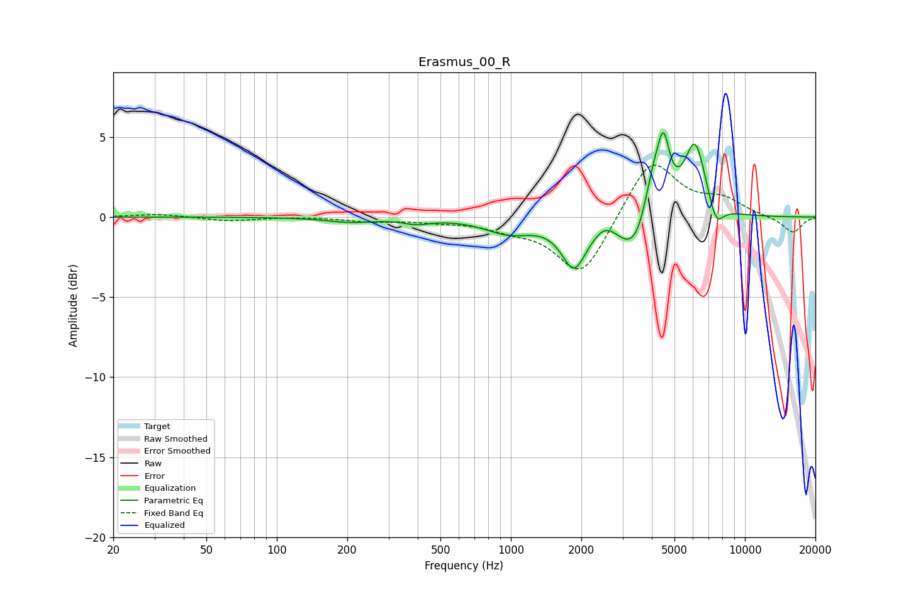

# Erasmus_00_R
See [usage instructions](https://github.com/jaakkopasanen/AutoEq#usage) for more options and info.

### Parametric EQs
Apply preamp of -5.4 dB when using parametric equalizer.

|   # | Type    |   Fc (Hz) |    Q |   Gain (dB) |
|-----|---------|-----------|------|-------------|
|   1 | Peaking |       205 | 1.4  |        -0.3 |
|   2 | Peaking |       395 | 2.61 |        -0.3 |
|   3 | Peaking |       980 | 1.39 |        -0.9 |
|   4 | Peaking |      1860 | 2.7  |        -2.9 |
|   5 | Peaking |      2550 | 3.03 |         0.7 |
|   6 | Peaking |      3530 | 1.81 |        -4   |
|   7 | Peaking |      4088 | 2.52 |         5   |
|   8 | Peaking |      4499 | 6    |         2.7 |
|   9 | Peaking |      6126 | 2.99 |         4.5 |
|  10 | Peaking |      7526 | 4.28 |        -1.5 |

### Fixed Band EQs
When using fixed band (also called graphic) equalizer, apply preamp of **-3.3 dB** (if available) and set gains manually with these parameters.

|   # | Type    |   Fc (Hz) |    Q |   Gain (dB) |
|-----|---------|-----------|------|-------------|
|   1 | Peaking |        31 | 1.41 |         0.2 |
|   2 | Peaking |        62 | 1.41 |        -0.2 |
|   3 | Peaking |       125 | 1.41 |         0   |
|   4 | Peaking |       250 | 1.41 |        -0.2 |
|   5 | Peaking |       500 | 1.41 |        -0.2 |
|   6 | Peaking |      1000 | 1.41 |        -0.6 |
|   7 | Peaking |      2000 | 1.41 |        -3.8 |
|   8 | Peaking |      4000 | 1.41 |         3.8 |
|   9 | Peaking |      8000 | 1.41 |         1   |
|  10 | Peaking |     16000 | 1.41 |        -1   |

### Graphs

