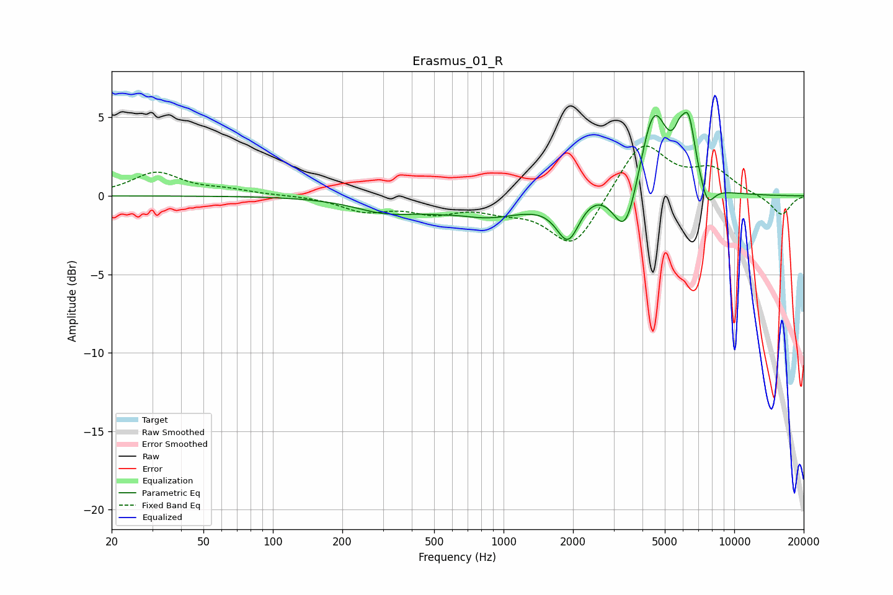

# Erasmus_01_R
See [usage instructions](https://github.com/jaakkopasanen/AutoEq#usage) for more options and info.

### Parametric EQs
Apply preamp of -5.4 dB when using parametric equalizer.

|   # | Type    |   Fc (Hz) |    Q |   Gain (dB) |
|-----|---------|-----------|------|-------------|
|   1 | Peaking |       304 | 1.07 |        -0.8 |
|   2 | Peaking |       667 | 1.68 |         0.2 |
|   3 | Peaking |       787 | 0.73 |        -1.4 |
|   4 | Peaking |      1908 | 2.74 |        -2.9 |
|   5 | Peaking |      2426 | 1.2  |         0.9 |
|   6 | Peaking |      3379 | 2.64 |        -3.7 |
|   7 | Peaking |      4469 | 2.33 |         5.7 |
|   8 | Peaking |      5777 | 6    |         1.3 |
|   9 | Peaking |      6340 | 4.47 |         3.9 |
|  10 | Peaking |      7655 | 4.46 |        -1.5 |

### Fixed Band EQs
When using fixed band (also called graphic) equalizer, apply preamp of **-3.3 dB** (if available) and set gains manually with these parameters.

|   # | Type    |   Fc (Hz) |    Q |   Gain (dB) |
|-----|---------|-----------|------|-------------|
|   1 | Peaking |        31 | 1.41 |         1.5 |
|   2 | Peaking |        62 | 1.41 |         0.3 |
|   3 | Peaking |       125 | 1.41 |         0   |
|   4 | Peaking |       250 | 1.41 |        -0.9 |
|   5 | Peaking |       500 | 1.41 |        -0.9 |
|   6 | Peaking |      1000 | 1.41 |        -0.7 |
|   7 | Peaking |      2000 | 1.41 |        -3.3 |
|   8 | Peaking |      4000 | 1.41 |         3.5 |
|   9 | Peaking |      8000 | 1.41 |         1.5 |
|  10 | Peaking |     16000 | 1.41 |        -1.3 |

### Graphs

