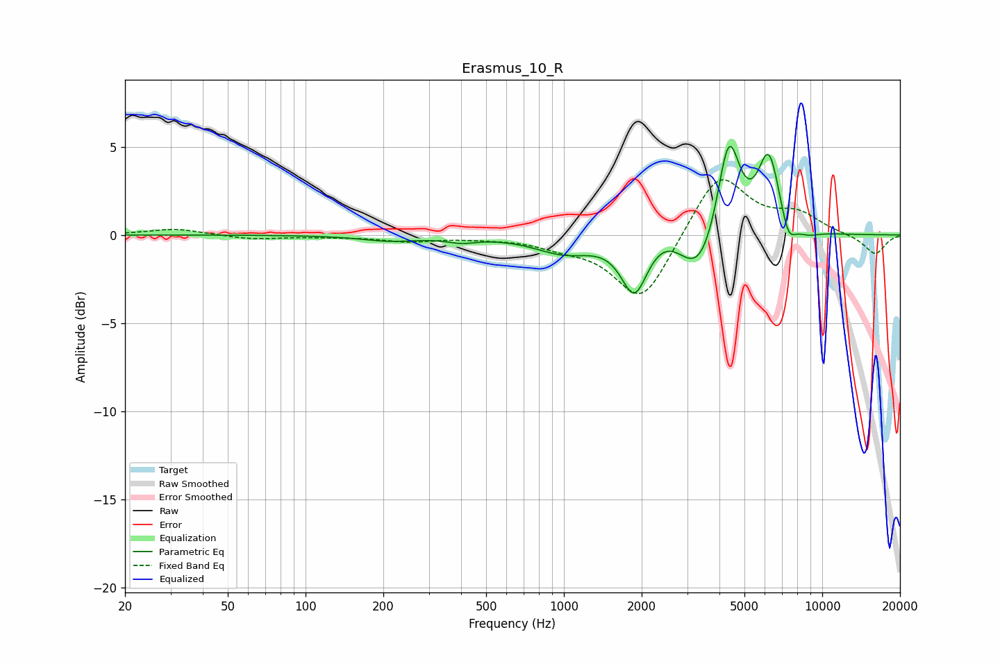

# Erasmus_10_R
See [usage instructions](https://github.com/jaakkopasanen/AutoEq#usage) for more options and info.

### Parametric EQs
Apply preamp of -5.1 dB when using parametric equalizer.

|   # | Type    |   Fc (Hz) |    Q |   Gain (dB) |
|-----|---------|-----------|------|-------------|
|   1 | Peaking |       211 | 1.3  |        -0.3 |
|   2 | Peaking |       402 | 2.48 |        -0.3 |
|   3 | Peaking |      1003 | 1.25 |        -0.9 |
|   4 | Peaking |      1875 | 2.8  |        -3.2 |
|   5 | Peaking |      2506 | 1.52 |         1   |
|   6 | Peaking |      3335 | 1.72 |        -2.9 |
|   7 | Peaking |      4343 | 3.19 |         5.8 |
|   8 | Peaking |      6211 | 3.2  |         4.5 |
|   9 | Peaking |      7390 | 4.78 |        -1.4 |
|  10 | Peaking |      8713 | 2.74 |        -0.3 |

### Fixed Band EQs
When using fixed band (also called graphic) equalizer, apply preamp of **-3.2 dB** (if available) and set gains manually with these parameters.

|   # | Type    |   Fc (Hz) |    Q |   Gain (dB) |
|-----|---------|-----------|------|-------------|
|   1 | Peaking |        31 | 1.41 |         0.4 |
|   2 | Peaking |        62 | 1.41 |        -0.2 |
|   3 | Peaking |       125 | 1.41 |        -0.1 |
|   4 | Peaking |       250 | 1.41 |        -0.3 |
|   5 | Peaking |       500 | 1.41 |        -0.1 |
|   6 | Peaking |      1000 | 1.41 |        -0.5 |
|   7 | Peaking |      2000 | 1.41 |        -3.9 |
|   8 | Peaking |      4000 | 1.41 |         3.6 |
|   9 | Peaking |      8000 | 1.41 |         1.1 |
|  10 | Peaking |     16000 | 1.41 |        -1.1 |

### Graphs

