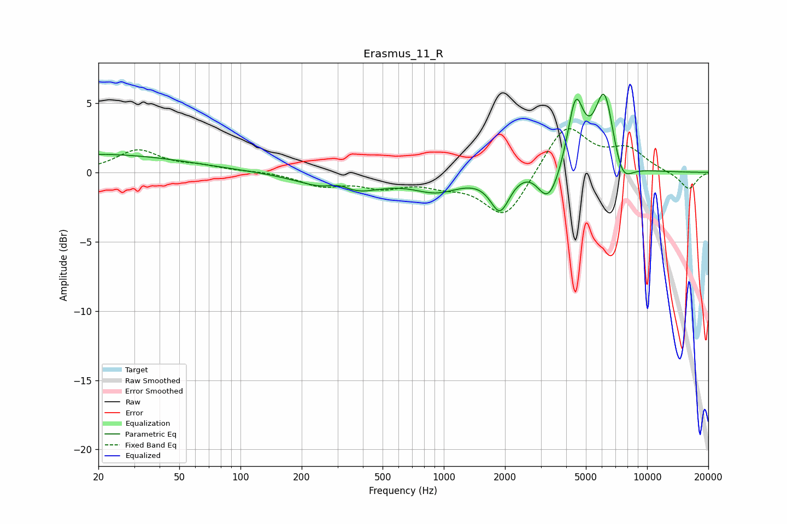

# Erasmus_11_R
See [usage instructions](https://github.com/jaakkopasanen/AutoEq#usage) for more options and info.

### Parametric EQs
Apply preamp of -5.7 dB when using parametric equalizer.

|   # | Type    |   Fc (Hz) |    Q |   Gain (dB) |
|-----|---------|-----------|------|-------------|
|   1 | Peaking |        20 | 0.33 |         1.3 |
|   2 | Peaking |       305 | 2.14 |         1   |
|   3 | Peaking |       319 | 0.96 |        -1.9 |
|   4 | Peaking |       923 | 1.23 |        -1.2 |
|   5 | Peaking |      1891 | 2.97 |        -2.6 |
|   6 | Peaking |      2908 | 1.59 |         1.5 |
|   7 | Peaking |      3247 | 2.24 |        -3.6 |
|   8 | Peaking |      4450 | 3.52 |         5   |
|   9 | Peaking |      6173 | 2.86 |         5.9 |
|  10 | Peaking |      7496 | 2.75 |        -2   |

### Fixed Band EQs
When using fixed band (also called graphic) equalizer, apply preamp of **-3.3 dB** (if available) and set gains manually with these parameters.

|   # | Type    |   Fc (Hz) |    Q |   Gain (dB) |
|-----|---------|-----------|------|-------------|
|   1 | Peaking |        31 | 1.41 |         1.6 |
|   2 | Peaking |        62 | 1.41 |         0.4 |
|   3 | Peaking |       125 | 1.41 |         0.1 |
|   4 | Peaking |       250 | 1.41 |        -0.9 |
|   5 | Peaking |       500 | 1.41 |        -0.9 |
|   6 | Peaking |      1000 | 1.41 |        -0.7 |
|   7 | Peaking |      2000 | 1.41 |        -3.4 |
|   8 | Peaking |      4000 | 1.41 |         3.5 |
|   9 | Peaking |      8000 | 1.41 |         1.5 |
|  10 | Peaking |     16000 | 1.41 |        -1.3 |

### Graphs

