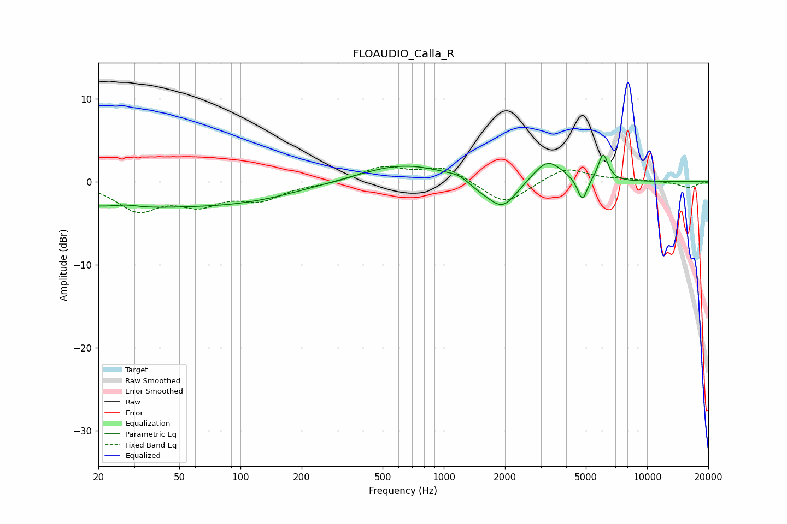

# FLOAUDIO_Calla_R
See [usage instructions](https://github.com/jaakkopasanen/AutoEq#usage) for more options and info.

### Parametric EQs
Apply preamp of -3.3 dB when using parametric equalizer.

|   # | Type    |   Fc (Hz) |    Q |   Gain (dB) |
|-----|---------|-----------|------|-------------|
|   1 | Peaking |        22 | 0.33 |        -2.8 |
|   2 | Peaking |        27 | 2.54 |         0.3 |
|   3 | Peaking |       108 | 0.51 |        -1.7 |
|   4 | Peaking |       640 | 0.65 |         2.2 |
|   5 | Peaking |      1199 | 2.73 |         0.6 |
|   6 | Peaking |      1489 | 1.88 |        -0.9 |
|   7 | Peaking |      1951 | 1.98 |        -3.3 |
|   8 | Peaking |      3242 | 2    |         2.7 |
|   9 | Peaking |      4806 | 5.81 |        -2.9 |
|  10 | Peaking |      6077 | 5.69 |         3.3 |

### Fixed Band EQs
When using fixed band (also called graphic) equalizer, apply preamp of **-1.9 dB** (if available) and set gains manually with these parameters.

|   # | Type    |   Fc (Hz) |    Q |   Gain (dB) |
|-----|---------|-----------|------|-------------|
|   1 | Peaking |        31 | 1.41 |        -3.2 |
|   2 | Peaking |        62 | 1.41 |        -2.4 |
|   3 | Peaking |       125 | 1.41 |        -1.9 |
|   4 | Peaking |       250 | 1.41 |        -0.2 |
|   5 | Peaking |       500 | 1.41 |         1.7 |
|   6 | Peaking |      1000 | 1.41 |         1.8 |
|   7 | Peaking |      2000 | 1.41 |        -2.8 |
|   8 | Peaking |      4000 | 1.41 |         1.8 |
|   9 | Peaking |      8000 | 1.41 |         0.2 |
|  10 | Peaking |     16000 | 1.41 |        -0.7 |

### Graphs

